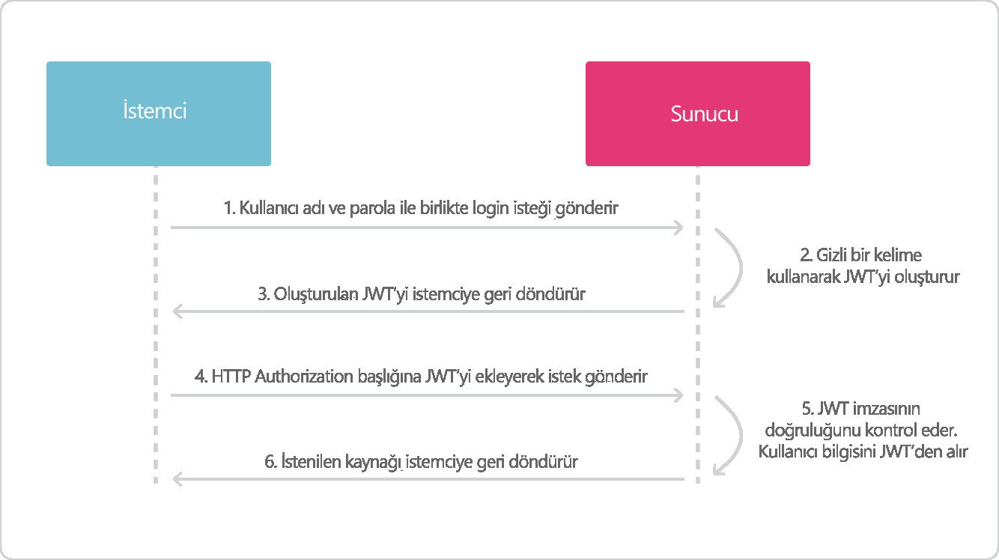

> **EĞİTİMDE OYUNLAŞTIRMA WEB PROJESİ**

**G181210055 -- Bedirhan Ergün**

> **ÖNSÖZ**

Teknoloji çağıyla birlikte hayat çok daha hızlı akmaya başlamıştır. Bu
hızlı akışa

ayak uydurmaya çalışılırken günlük yaşamda yapılması gereken işler,
görevler, vb.

bazen çok sıkıcı hale gelebilmekte, bu da performans düşüklüğüne neden
olmaktadır.

Bu soruna çözüm bulmanın en iyi yollarından biri oyunlaştırmadır.
Oyunlaştırma

hayatın içindeki görevleri yerine getirirken eğlenmeyi sağlamakla
kalmayıp,

görevlerdeki performansı en üst düzeye çıkarmaktadır. Bizde
oyunlaştırmaya

üniversiteye hazırlanan öğrencilerin motivasyonlarını yüksek tutmak ve
ders çalışma

sürelerini arttırmak için gamification dinamiklerini kullanarak Egitim
Partneri

> uygulamasını geliştirdik.
>
> Bu çalışmada bize destek olan Prof. Dr. Ahmet Zengin'e teşekkürleri
> borç biliriz

\"v

> **İÇİNDEKİLER**

> **BÖLÜM 2.VERİ TABANI
> 1. POSTGRESQL VERİ TABANI
> 2. VERİ TABANI YAPISI
> 3. TABLO YAPILARI
> 4. USER TABLOLARI
> 5. DERS TABLOLARI
> 6. KAYIT TABLOSU
> 7. DERS ANALİZ TABLOSU
> 8. TEST TABLOSU
> 9. FORUM TABLOSU
> 10. BLOG TABLOSU

> **BÖLÜM 3.API VE GÜVENLİK
> 1. VERİ TABANI BAĞLANTISI
> 2. APİ GÜVENLİĞİ
> 3. SWAGER APİ DÖKÜMANSAYNONU
> 4. EXCEPTİON

>**BÖLÜM 4.OYUN DİNAMİKLERİ
> 1. TEST MEKANİĞİ
> 2. PUAN MEKANİĞİ
> 3. LEVEL MEKANİĞİ

>**BÖLÜM 5.YÖNETİM PANELİ
> 1. KULLANICI YÖNETİMİ
> 2. UYGULAMA METRİKLERİ

>**BÖLÜM 6.ÖN YÜZ(FRONTEND) KISMI-EKRANLAR
> 1. LOGİN-REGİSTER EKRANI
>   1. Üye G1r1ş Ekranı
>   2. Üye Olma Ekranı
>   3. Ş1frem1 Unuttum Ekranı
> 2. PROFİL
> 3. DERSLER EKRANI
> 4. DERS DETAY EKRANI
> 5. BÖLÜM DETAY
> 6. TEST EKRANI
> 7. DERS-ANALİZ EKRANI
> 8. DUELLO
> 9. BAŞARI SIRALAMASI
> 10. BLOG SAYFASI

**BÖLÜM 7.SONUÇLAR VE ÖNERİLER

**BÖLÜM 8.KAYNAKÇA

> **BÖLÜM 2.VERİ TABANI**

Backend kısmını java spring boot tercih ettiğimizden java ile iyi
çalışan veri tabanı

> postgresql ile oluşturduk.
>
> **2.1 Postgresql Veri Tabanı**

PostgreSQL, gelişmiş, kurumsal sınıf ve açık kaynaklı bir ilişkisel
veritabanı

sistemidir. PostgreSQL, hem SQL (ilişkisel) hem de JSON (ilişkisel
olmayan)

sorgulamayı destekler. PostgreSQL, açık kaynak topluluğu tarafından 20
yılı aşkın

geliştirmeyle desteklenen oldukça kararlı bir veritabanıdır. PostgreSQL,
birçok web

uygulamasının yanı sıra mobil ve analitik uygulamalar için birincil
veritabanı olarak

> kullanılır.

Şekil 2.1 Örnek PostgreSQL tablosu

> **2.2 Veri Tabanı Yapısı**
>
> Veri tabanı ilişkisel yapımız aşağıdaki gibidir:
>
> Şekil 2.2 Veri tabanı yapısı

> **2.3 Tablo Yapıları**
>
> Veri tabanlarında, verileri tutmak için belli tablolar
> hazırlanmaktadır. Projemizin veri tabanında işlemekte olan toplam 28
> tablomuz bulunmaktadır

  ----------------------------------------------------------------------------------------------------------------------------
  
  ----------------------------------------------------------------------------------------------------------------------------

Şekil 2.3 Tablo yapıları

> **2.4 User Tabloları**

User işlemlerinde yetkilendirme kullandığımız için her kullanıcın
yetkisi için farklı

bir tablo daha oluşturuldu. Yetkilendirme gelen kullanıcının hangi
izinlere yetkisi

olduğu bilgisini tutan tablo. Ayrıca öğrenci ve öğretmen tabloları user
tablosundan

> kalıtım alarak öğrenci ve öğretmenin kullanıcı olduğunu tanımlıyoruz.

Şekil 2.3 Kullanıcı tablo yapısı

> **2.5 Ders Tabloları**

Uygulamamıza dersleri eklerken kullandığımız tablolar. Her dersin bir
müfredatı

oluyor bu müfredatın içinde bolümler oluyor. Bolüm ile müfredat arasında
çok çok ilişkisi var.

> Şekil 2.4 Ders tabloları

> **2.6 Kayıt Tablosu**

Öğrencinin derse kayıt bilgisini tutmak için kayıt tablosu. Öğrenci
derse ait testleri

ve dokümanlara erişebilmesi için derse kaydolması gerekmekte. Kayıt
bilgilerinin tutulması için kayıt tablosu gerekliydi.

>
> Şekil 2.5 Kayıt tablo yapısı
>
> **2.7 Ders Analiz Tablosu**

Öğrenci derse kaydolduktan sonra derse ait analiz bilgilerini tutmak
için ders analiz tablosu

Şekil 2.6 Ders analiz tablo yapısı

> **2.8 Test Tablosu**

Bölüme ait testleri bulunduran test tablosu
>
> Şekil 2.7 Test tablosu
>
> **2.9 Forum Tablosu**
 
Öğrencilerin derslere yorum yapabilmesi için derse ait forum tablosu
 oluşturduk.
>
> Şekil 2.8 Forum tablosu

> **2.10 Blog Tablosu**

Öğretmenlerin öğrencileri bilgilendirmesi için blog yazılar paylaşmasına
yönelik

blog tablosu. Her öğretmen blog tablosuna kayıtlı. Blog tablosu entry
tablosuna

birçok ilişkili yani bir bloğun içinde çok entry(yazi) olabilir. Her
entry'nin tag(ilgili konu) bilgi için ayrı bir tag tablosu oluşturuldu.
>
> Şekil 2.9 Blog tablosu

> **BÖLÜM 3.API VE GÜVENLİK**

Veri tabanını tabloları oluşturduktan sonra bunları kullanıcıya
ulaştırmak için önce

API oluşturmamız lazım. Arka tarafta(backend) api oluşturmak için java
dilini

kullandım ve java'nın popüler olan spring kütüphanesini kullanarak Api
oluşturdum.

Spring kütüphanesi postgres bağlantısı için Spring Data JPA
kütüphanesini

kullandım. Bu yöntem ile code first yaklaşımı ile tabloları kod kısmında
oluşturdum.

> **3.1 Veri Tabanı Bağlantısı**

Veri tabanı bağlantısı yaparken spring kütüphanesinin kolay bir şekilde
veri tabanına

bağlanmayı sağlıyor. Gerekli dependencileri pom.xml dosyasına ekliyoruz.
Bu

> sayede otomatik olarak kullanacağız ihtiyacı olan kütüphaneleri
> indiriyor.

+----------+----------+-------+----------+----------+--------+------+
| > \<depe |          |       |          |          |        |      |
| ndency\> |          |       |          |          |        |      |
+==========+==========+=======+==========+==========+========+======+
| >        |          |       |          |          |        |      |
|  \<group |          |       |          |          |        |      |
| Id\>org. |          |       |          |          |        |      |
| springfr |          |       |          |          |        |      |
| amework. |          |       |          |          |        |      |
| boot\</g |          |       |          |          |        |      |
| roupId\> |          |       |          |          |        |      |
+----------+----------+-------+----------+----------+--------+------+
| > \      |          |       |          |          |        |      |
| <artifac |          |       |          |          |        |      |
| tId\>spr |          |       |          |          |        |      |
| ing-boot |          |       |          |          |        |      |
| -starter |          |       |          |          |        |      |
| -data-jp |          |       |          |          |        |      |
| a\</arti |          |       |          |          |        |      |
| factId\> |          |       |          |          |        |      |
+----------+----------+-------+----------+----------+--------+------+
| >        |          |       |          |          |        |      |
|  \</depe |          |       |          |          |        |      |
| ndency\> |          |       |          |          |        |      |
+----------+----------+-------+----------+----------+--------+------+
| > \<depe |          |       |          |          |        |      |
| ndency\> |          |       |          |          |        |      |
+----------+----------+-------+----------+----------+--------+------+
| > \<gro  |          |       |          |          |        |      |
| upId\>or |          |       |          |          |        |      |
| g.postgr |          |       |          |          |        |      |
| esql\</g |          |       |          |          |        |      |
| roupId\> |          |       |          |          |        |      |
+----------+----------+-------+----------+----------+--------+------+
| >        |          |       |          |          |        |      |
|  \<artif |          |       |          |          |        |      |
| actId\>p |          |       |          |          |        |      |
| ostgresq |          |       |          |          |        |      |
| l\</arti |          |       |          |          |        |      |
| factId\> |          |       |          |          |        |      |
+----------+----------+-------+----------+----------+--------+------+
| > \<s    |          |       |          |          |        |      |
| cope\>pr |          |       |          |          |        |      |
| ovided\< |          |       |          |          |        |      |
| /scope\> |          |       |          |          |        |      |
+----------+----------+-------+----------+----------+--------+------+
| >        |          |       |          |          |        |      |
|  \</depe |          |       |          |          |        |      |
| ndency\> |          |       |          |          |        |      |
+----------+----------+-------+----------+----------+--------+------+
| >        | ek       | sonra | konfi    | ay       | yapmak | için |
|  Depende | ledikten |       | gürasyon | arlarını |        |      |
| ncy'leri |          |       |          |          |        |      |
+----------+----------+-------+----------+----------+--------+------+

> bağlanacağımız database bilgilerini projeye özellikler dosyasına
> ekliyoruz.

+----------------------------------------------------------------------+
| > spring:\                                                           |
| > datasource:\                                                       |
| > type: com.zaxxer.hikari.HikariDataSource\                          |
| > url: jdbc:postgresql://localhost:5432/Gamification username:       |
| > Gamification\                                                      |
| > password:\                                                         |
| > hikari:\                                                           |
| > poolName: Hikari\                                                  |
| > auto-commit: false\                                                |
| > jpa:\                                                              |
| > database-platform:\                                                |
| > tech.jhipster.domain.util.FixedPostgreSQL10Dialect hibernate:\     |
| > ddl-auto: update                                                   |
+----------------------------------------------------------------------+

25

> **3.2 Api Güvenliği**

Web projelerimizi geliştirirken kullanıcı kimliklendirme/yetkilendirme
işlemi

oldukça önemlidir. Uygulamamızı yetkisiz kişilerden korumak ve yalnızca
yetkili

kullanıcıların erişimi için çeşitli yöntemler kullanırız. Bu çözümlerden
birisi de token

kullanmaktır. İşte bu noktada çeşitli standartlar bulunmaktadır. Ben
projemde JWT

> ile Authorization yöntemini kullandım.

{width="5.708333333333333in"
height="3.201388888888889in"}

Şekil 3.1 JWT senaryo

> **3.3 Swager Api Dökümansaynonu**

Swagger API, yazılım geliştiricilerin RESTful web hizmetlerini
tasarlamasına,

oluşturmasına, belgelemesine ve kullanmasına yardımcı olan geniş bir
araç

ekosistemi tarafından desteklenen açık kaynaklı bir yazılım
framework'udur. Projede

çok fazla controller olduğu için api dökümantasyonuna ihtiyaç artıyordu.
Projede

> swager ekleyerek api dökümantasyonumuzu gerçekleştirdik.
>
> {width="4.545832239720035in"
> height="2.323610017497813in"}Şekil 3.2 Swager api gönüntüsü

26

> **3.4 Exception**

Projede hata durumlarında fırlatılacak hatalar için özel exceptionlar
oluşturdum

java'nın hata durumlarını yönetme sistemi çok gelişmiş olduğu için onun

> avantajlarından yararlandım. Projeye özel hatalar için özel
> exceptionlar tanımladım.
>
> {width="4.25in"
> height="2.055554461942257in"}Şekil 3.3 Özel exception\'lar

27

> **BÖLÜM 4.OYUN DİNAMİKLERİ**

Projede kullandımı oyun mekaniklerinin backend kısmında nasıl
oluşturduğumu

> hangi algoritmaları kullandığımı anlatıyorum.
>
> **4.1 Test Mekaniği**

Öğrenci testi çözdüğü zaman testin id'sini ve cevapları backend'e
gönderiyor.

Backendeki test servisinde test id'si ile veri tabanından çekilen test
cevapları

gönderilen cevaplarla karşılaştırılıp sonucu geriye kullanıcıya geri
döndürüyoruz.

Bunu yaparken aynı anda soru ve test bilgilerini öğrencinin ders analiz
sayfasına

> kayıt ediyoruz. Daha sonra çözdüğü sorunun analizini görmek için.

+----------------------------------------------------------------------+
| > List\<String\> cevapAnahtari =                                     |
| > cevapAnahtariOlustur(test.getCevaplar());\                         |
| > for (int i = 0; i \< cevapAnahtari.size(); i++) {\                 |
| > if (dto.getAnswers().get(i).equals(\"\") \|\|                      |
| > dto.getAnswers().get(i) == null) { result.increaseOfBlank();\      |
| > } else if (cevapAnahtari.get(i).equals(dto.getAnswers().get(i)))   |
| > {\                                                                 |
| > result.increaseOfCorrect();\                                       |
| > } else {\                                                          |
| > result.increaseOfWrong();\                                         |
| > }\                                                                 |
| > }                                                                  |
+----------------------------------------------------------------------+

> **4.2 Puan Mekaniği**

Öğrenci çözdüğü testlerden puan kazanıyor. Her net için 10 puan
kazanıyor eğer eksi

net yaparsa test için, o testi tekrar çözüyor o bilgiyi sisteme
kaydetmiyoruz.

> Kazandığı puanlarla öğrencilerin sıralamasına katılıyor.

28

> **4.3 Level Mekaniği**

Öğrenciler puan kazandıklarında puan kaydedilirken level bilgisi ile
kontrol ediliyor.

Eğer puanı bir sonraki levelin puanını geçiyorsa öğrenci sistem üzerinde
leveli

> yükseltiliyor.

Level'leri bir önceki levelin 1.5 üstü ile çarpımından hesaplıyoruz. İlk
levelin puan

1000 puan. Bir sonraki levelin puanı 1000 \* level \^ 1.5 ile
hesaplanıyor. Toplam 100

level var 1000=1, 2828=2, 5196=3, 8000=4, 11180=5, 14696=6, 18520=7,
22627=8,

27000=9... 955339=97, 970150=98, 985037=99, 1000000=100 levellere göre

> puanlar bu şekilde

+---------------------------------------------------------------+
| > public double nextLevel(double level) {\                    |
| > var exponent = 1.5;\                                        |
| > var baseXP = 1000;\                                         |
| > return Math.floor(baseXP \* (Math.pow(level, exponent))); } |
+---------------------------------------------------------------+

29

> **BÖLÜM 5.YÖNETİM PANELİ**
>
> **5.1 Kullanıcı Yönetimi**

Yönetim paneline girişi yalnızca admin yetkisine sahip kullanıcılar
girebilir. Admin

yetkisinde sadece admin verebilir kullanıcı yönetim sayfasından. Bu
sayfadan

kullanıcı aktif ve pasif edebilir. Kullanıcı sisteme giriş yaptıktan
sonra giriş yaptığı

mail adresine hesabını aktif etmek için kod gönderiliyor eğer oradan
aktif edemezse

> admin bu sayfa üzerinden aktif edebilir.
>
> {width="5.708333333333333in"
> height="2.6416666666666666in"}Şekil 5.1 Kullanıcı paneli
>
> **5.2 Uygulama Metrikleri**

Backend uygulamasını hangi durumda olduğu göstermek için hafıza,
çekirdek ve

sistem bilgilerinin ne durumda olduğunu göstermesi için java spring boot
eklentileri

> eklenerek kolayca entegre ettik.
>
> {width="5.591666666666667in"
> height="2.5874989063867018in"}Şekil 5.2 Uygulama metrikleri

30

> **BÖLÜM 6.ÖN YÜZ(FRONTEND) KISMI-EKRANLAR**\
> Frontend kısmını angular 13 ile yazdım. Angular, Google tarafından
> geliştirilen ve

desteklenen SPA(Single Page Application) uygulama yapılmasına olanak
sağlayan

javascript kütüphanesidir. Backend uygulamasını angulara bağlayarak api

> bağlantısını yaptım.
>
> **6.1 Login-Register Ekranı**
>
> Kullanıcıların sisteme giriş yapabildikleri ekran
>
> **6.1.1 Üye Giriş Ekranı**
>
> {width="4.676388888888889in"
> height="2.7819444444444446in"} Şekil 6.1 Giriş yap ekran görüntüsü
>
> **6.1.2 Üye Olma Ekranı**

Hesabınızı oluşturduktan sonra girdiğiniz mail adrese hesabınızı aktif
etme kodu

> gönderiliyor\
> {width="4.168055555555555in"
> height="2.3222222222222224in"}

Şekil 6.2 Üye ol ekran görüntüsü

{width="3.422222222222222in"
height="2.6632436570428695in"}{width="2.9861100174978126in"
height="3.5728543307086613in"}

31

> Mail adresinize gidip oradan linke tıklamalısınız

Şekil 6.3 Mail gönderildikten sonra gelen ekran görüntüsü

> Maildeki linke tıkladıktan sonra işlem başarılı ise succes değilse
> error mesajını
>
> görüyorsunuz

{width="2.8263877952755907in"
height="3.3847222222222224in"}

+----------------------------------+----------------------------------+
| > Şekil 6.4 Hesap aktif olduktan | > Şekil 6.5 Hesap aktif olmazsa  |
| > sonra ekran görüntüsü          | > görünen ekran görüntüsü        |
+----------------------------------+----------------------------------+

32

> **6.1.3 Şifremi Unuttum Ekranı**

{width="5.708333333333333in"
height="3.563888888888889in"}

Şekil 6.6 Şifremi unuttum ekran görüntüsü

Şifrenizi yenile sayfasında gönderdiğiniz mail adresinize link
gönderiliyor linke

> tıklayınca sizi aşağıdaki sayfaya yönlendiriyor\
> {width="5.708333333333333in"
> height="2.988888888888889in"} Şekil 6.7 Şifre yenileme ekran görüntüsü

33

> **6.2 Profil**

Giriş yaptıktan sonra profil sayfası karşılıyor bizi. Bu sayfada
kullanıcı hakkında kısa

> bilgiler var. Kazandığı rozetler ve haftalık soru hedefi yine bu
> sayfada gözüküyor.
>
> {width="5.708333333333333in"
> height="3.109722222222222in"}Şekil 6.8 Profil ekran görüntüsü
>
> {width="5.708333333333333in"
> height="4.008333333333334in"}Şekil 6.9 Profil bilgileri güncelleme
> ekran görüntüsü

34

> **6.3 Dersler Ekranı**

Admin ve öğretmenler tarafından oluşturulan dersler bu sayfada
öğrencinin karşısına

çıkıyor. Kullanıcı giriş yapmışsa derse kayıt olabiliyor, giriş yapmamış
sadece dersin

> içeriğini görebiliyor
>
> {width="5.708333333333333in"
> height="5.554166666666666in"}Şekil 6.10 Dersler ekran görüntüsü

35

> **6.4 Ders Detay Ekranı**

Kullanıcı dersin üstüne tıkladığı zaman dersin bölümleri gelmekte bu
sayfadan ders

> hakkında bilgi ve dersin bölümlerini görebiliyor.

{width="5.708333333333333in"
height="3.1305544619422574in"}

Şekil 6.11 Ders detay ekran görüntüsü

36

> **6.5 Bölüm Detay**

Girilen dersin içindeki bölümlerden bölüme tıkladıktan sonra ders
çalıştığınız

bölüme giriş yapıyorsunuz bölüm sayfasında video içerik ve doküman
oluyor. Dersi

> bitirdikten sonra ders hakkında test çözüyorsunuz.
>
> {width="5.708333333333333in"
> height="3.75in"}Şekil 6.12 Bölüm detay ekranı

37

> **6.6 Test Ekranı**

Bölümün dersini izledikten sonra çalışılan konu hakkında test çözüme
sayfası testi

> tamamladıktan sonar doğru yanlış sayısını size geri döndürüyor.
>
> {width="5.708333333333333in"
> height="3.8944433508311462in"}Şekil 6.13 Çözülmemiş test ekranı
>
> Teste gönder\"nce doğru, yanlış ve boş sayısı backend kısmında
> hesaplayıp b\"ze sonucunu ger\" döndürüyor
>
> {width="5.161111111111111in"
> height="3.6180555555555554in"}Şekil 3.14 Çözülmüş test ekran görüntüsü

38

> **6.7 Ders-Analiz Ekranı**
>
> Çözdüğümüz soruların analizini yapabileceğimiz analiz sayfası
>
> {width="5.708333333333333in"
> height="4.0013877952755905in"}Şekil 6.15 Ders detay sayfası ekran
> görüntüsü

39

> **6.8 Düello**

Düello sayfasında öğrenci soru çözüyor. Doğru şıkkı işaretleyince kendi
karakteri

karşıdaki karaktere vuruyor, yanlış cevapta karşıdaki karakter oyuncunun
karakterini

dövüyor. Sayfanın üstünde can barı var hangi karakter daha fazla döverse
o karakter

> kazanıyor. Bu sayede öğrenciyi daha fazla soru çözmesini sağlamaya
> çalışıyoruz.

{width="5.708333333333333in"
height="3.723610017497813in"}

Şekil 6.16 Düello sayfası ekran görüntüsü

40

> **6.9 Başarı Sıralaması**

Öğrencilerin kazandıkları puanlara göre diğer öğrenciler ile sıralamaya
girdikleri ilk

> on öğrencinin sıralama sayfası
>
> {width="5.708333333333333in"
> height="3.723611111111111in"}Şekil 6.17 Başarı sıralaması ekran
> görüntüsü

41

> **6.10 Blog Sayfası**

Blog sayfası öğrencilerin ve web sitesini ziyaret edenlerin
bilgilenebileceği genel bir

sayfa bu sayfa sayesinde hem kendi kullanıcıları bilgileniyor hemde
yabancı

ziyaretçileri web sayfasına çekiyoruz. İnternette arama yaptığı
kelimeler eğer blog

> sayfasındaki bilgilerle eşleşiyorsa ziyaretçiyi bizim web sayfasına
> yönlendirecek
>
> Böylece daha fazla kullanıcı çekme şansımız artıyor.
>
> {width="5.438888888888889in"
> height="3.548611111111111in"}

Şekil 6.18 Blog sayfası ekran görüntüsü

> {width="5.233332239720035in"
> height="4.104165573053368in"}Şekil 6.19 Blog detay sayfası

42

> **BÖLÜM 7. SONUÇLAR VE ÖNERİLER**

Çalışmamız sonucunda tezin hedeflediği amaçlar fazlasıyla yerine
getirilmiştir. Hem

gelecekte bu konuda çalışma yapmak isteyen kişilere bir rehber niteliği
taşımakta

olup hem de bütün fonksiyonları tam anlamıyla çalışan bir proje ve
platform ortaya

konmuştur. Gamification dinamiklerinin olduğu öğrencilerin derslerini
takip

> edebileceği ve ders çalışabileceği bir platform başarıyla
> çalışmaktadır.

Projemiz şu anda canlı ortamda çalışmaya hazır ve kaynak kodları tamamen
açık

> şekilde Github'da paylaşılmıştır.
>
> Backend Github repositroy:
> https://github.com/kodmen/egitim-partneri-back
>
> Frontend Github repository:
> https://github.com/kodmen/gamificationFront
>
> Projenin geleceğinde ise:
>
> •Dershane ve özel eğitim kurumları ile anlaşarak onların doküman
> yardımları
>
> ile tam donanımlı bir eğitim platformu haline gelinebilir\
> •Gönüllü eğitmenler ile öğrencilere ücretsiz eğitim imkânı sunulabilir
> •Yeni oyun dinamikleri eklenerek proje geliştirilebilir
>
> **BÖLÜM 8.KAYNAKÇA**
>
> \[1\] p. K. Werbach, «Gamification,» \[Çevrimiçi\]. Available:
>
> https://www.coursera.org/learn/gamification\#instructors.

\[2\] «Bical, A. (2018). Oyunlaştırmada Oyun Elemanlarının Kullanımı:
Adidas

> Micoach, Khan Academy, Superbetter ve Swarm Uygulamalarının Örnek Olay
>
> Yöntemi İle İncelenmesine Yönelik Keşifsel Bir Çalışma (Doctoral
> dissertation,
>
> Anadolu University (Turkey)).».

\[3\] K. C. a. S. King, «Understanding industrial design: Be playful,»
\[Çevrimiçi\].

> Available:
> https://www.oreilly.com/content/understanding-industrial-design-
>
> playful/.

\[4\] «Deterding, S., Dixon, D., Khaled, R., & Nacke, L. (2011,
September). From

> game design elements to gamefulness: defining\" gamification\". In
> Proceedings of
>
> the 15th international academic MindTrek conference: Envisioning
> future media
>
> environments (pp. 9-15)».

\[5\] «Soman, D., & Huang, W. H. Y. (2013). A practitioner's guide to
gamification of

> education. Toronto: University of Toronto.».

\[6\] «KILIÇARSLAN, Z., & Altuğ, E. (2018). Kütüphanelerde Oyunlaştırma.
Türk

> Kütüphaneciliği, 32(3), 208-222.».

**44**

> **ÖZGEÇMİŞ**

Bedirhan Ergün 13.11.1999 de İstanbul Kadıköy'de doğdu. İlk, orta ve
lise eğitimini

Ümraniye de tamamladı. 2017 Erkut Soyak Anadolu lisesinden mezun oldu.
2018

Sakarya üniversitesi bilgisayar mühendisliği bölümünü kazandı. 2020
yılında

morphosium sturtup bir şirkette java backend geliştirici olarak çalıştı.
2022 yılında

> Sakarya üniversitesinden mezun olacak.

**45**

**BSM 498 BİTİRME ÇALIŞMASI**

**DEĞERLENDİRME VE SÖZLÜ SINAV TUTANAĞI**

> KONU: Gamification ile Eğitim Projesi\
> ÖĞRENCİLER (Öğrenci No/AD/SOYAD):\
> G181210055/BEDİRHAN/ERGÜN

+--------------------------------------+------------+---------+-----+
| DeğerlendNrme Konusu                 | İstenenler | Not     | Not |
|                                      |            |         |     |
|                                      |            | Aralığı |     |
+======================================+============+=========+=====+
| > **Yazılı Çalışma**                 |            |         |     |
+--------------------------------------+------------+---------+-----+
| > **Çalışma klavuza uygun olarak     | x          | 0-5     |     |
| > hazırlanmış mı?**                  |            |         |     |
+--------------------------------------+------------+---------+-----+
| > **Tekn.k Yönden**                  |            |         |     |
+--------------------------------------+------------+---------+-----+
| > **Problem\[n tanımı yapılmış mı?** | x          | 0-5     |     |
+--------------------------------------+------------+---------+-----+
| > Gel1şt1r1lecek yazılımın/donanımın |            |         |     |
| > m1mar1s1n1 1çeren blok şeması\     |            |         |     |
| > (yazılımlar 1ç1n ver1 akış şeması  |            |         |     |
| > (dfd) da olab1l1r) ç1z1lerek       |            |         |     |
| > açıklanmış mı?                     |            |         |     |
+--------------------------------------+------------+---------+-----+
| Blok şemadak1 b1r1mler arasındak1    |            |         |     |
| b1lg1 akışına a1t model/göster1m var |            |         |     |
| mı?                                  |            |         |     |
+--------------------------------------+------------+---------+-----+
| > Yazılımın gereks1n1m l1stes1       |            |         |     |
| > oluşturulmuş mu?                   |            |         |     |
+--------------------------------------+------------+---------+-----+
| > Kullanılan/kullanılması düşünülen  |            |         |     |
| > araçlar/teknoloj1ler anlatılmış    |            |         |     |
| > mı?                                |            |         |     |
+--------------------------------------+------------+---------+-----+
| > Donanımların                       |            |         |     |
| > programlanması/konf1gürasyonu 1ç1n |            |         |     |
| > yazılım gereks1n1mler1 bel1rt1lm1ş |            |         |     |
| > m1?                                |            |         |     |
+--------------------------------------+------------+---------+-----+
| > UML 1le modelleme yapılmış mı?     |            |         |     |
+--------------------------------------+------------+---------+-----+
| > Ver1tabanları kullanılmış 1se      |            |         |     |
| > kavramsal model çıkarılmış mı?     |            |         |     |
| > (Varlık 1l1şk1 model1, noSQL       |            |         |     |
| > kavramsal modeller1 v.b.)          |            |         |     |
+--------------------------------------+------------+---------+-----+
| Projeye yönel1k 1ş-zaman ç1zelges1   |            |         |     |
| çıkarılarak mal1yet anal1z1 yapılmış |            |         |     |
| mı?                                  |            |         |     |
+--------------------------------------+------------+---------+-----+
| > Donanım b1leşenler1n1n mal1yet     |            |         |     |
| > anal1z1 (protot1p-adetl1 ser1      |            |         |     |
| > üret1m vb.) çıkarılmış mı?         |            |         |     |
+--------------------------------------+------------+---------+-----+
| > Donanım 1ç1n gerekl1 enerj1        |            |         |     |
| > anal1z1                            |            |         |     |
| > (m1n1mum-uyku-akt1f-maks1mum)      |            |         |     |
| > yapılmış mı?                       |            |         |     |
+--------------------------------------+------------+---------+-----+
| > Grup çalışmalarında grup           |            |         |     |
| > üyeler1n1n görev tanımları         |            |         |     |
| > ver1lm1ş m1 (1ş-zaman ç1zelges1nde |            |         |     |
| > bel1rt1leb1l1r)?                   |            |         |     |
+--------------------------------------+------------+---------+-----+
| > Sürüm denet1m s1stem1 (Vers1on     |            |         |     |
| > Control System; G1t, Subvers1on    |            |         |     |
| > v.s.) kullanılmış mı?              |            |         |     |
+--------------------------------------+------------+---------+-----+
| > S1stem1n genel test1 1ç1n          |            |         |     |
| > uygulanan metotlar ve 1y1leşt1rme  |            |         |     |
| > süreçler1n1n dökümü ver1lm1ş m1?   |            |         |     |
+--------------------------------------+------------+---------+-----+
| > Yazılımın sızma test1 yapılmış mı? |            |         |     |
+--------------------------------------+------------+---------+-----+
| > Performans test1 yapılmış mı?      |            |         |     |
+--------------------------------------+------------+---------+-----+
| > Tasarımın uygulamasında ortaya     |            |         |     |
| > çıkan uyumsuzluklar ve aksaklıklar |            |         |     |
| > bel1rt1lerek çözüm yöntemler1      |            |         |     |
| > tartışılmış mı?                    |            |         |     |
+--------------------------------------+------------+---------+-----+
| > **Yapılan \[şler\[n zorluk         | x          | 0-25    |     |
| > dereces\[?**                       |            |         |     |
+--------------------------------------+------------+---------+-----+
| > **Sözlü Sınav**                    |            |         |     |
+--------------------------------------+------------+---------+-----+
| > **Yapılan sunum başarılı mı?**     | x          | 0-5     |     |
+--------------------------------------+------------+---------+-----+
| > **Soruları yanıtlama               | x          | 0-20    |     |
| > yetk\[nl\[ğ\[?**                   |            |         |     |
+--------------------------------------+------------+---------+-----+
| > **Devam Durumu**                   |            |         |     |
+--------------------------------------+------------+---------+-----+
| > **Öğrenc( dönem (çer(s(ndek(       | x          | 0-5     |     |
| > raporlarını düzenl( olarak         |            |         |     |
| > hazırladı mı?**                    |            |         |     |
+--------------------------------------+------------+---------+-----+
| > **D.ğer Maddeler**                 |            |         |     |
+--------------------------------------+------------+---------+-----+
|                                      |            |         |     |
+--------------------------------------+------------+---------+-----+
|                                      |            |         |     |
+--------------------------------------+------------+---------+-----+
|                                      |            |         |     |
+--------------------------------------+------------+---------+-----+
| > **Toplam**                         |            |         |     |
+--------------------------------------+------------+---------+-----+

> DANIŞMAN (JÜRİ ADINA): PROF.DR.AHMET ZENGİN DANIŞMAN İMZASI:
