> **EĞİTİMDE OYUNLAŞTIRMA WEB PROJESİ**

**G181210055 -- Bedirhan Ergün**

> **ÖNSÖZ**

Teknoloji çağıyla birlikte hayat çok daha hızlı akmaya başlamıştır. Bu
hızlı akışa

ayak uydurmaya çalışılırken günlük yaşamda yapılması gereken işler,
görevler, vb.

bazen çok sıkıcı hale gelebilmekte, bu da performans düşüklüğüne neden
olmaktadır.

Bu soruna çözüm bulmanın en iyi yollarından biri oyunlaştırmadır.
Oyunlaştırma

hayatın içindeki görevleri yerine getirirken eğlenmeyi sağlamakla
kalmayıp,

görevlerdeki performansı en üst düzeye çıkarmaktadır. Bizde
oyunlaştırmaya

üniversiteye hazırlanan öğrencilerin motivasyonlarını yüksek tutmak ve
ders çalışma

sürelerini arttırmak için gamification dinamiklerini kullanarak Egitim
Partneri

> uygulamasını geliştirdik.
>
> Bu çalışmada bize destek olan Prof. Dr. Ahmet Zengin'e teşekkürleri
> borç biliriz

\"v

> **İÇİNDEKİLER**

**SİMGELER VE KISALTMALAR LİSTESİ
\...\...\...\...\...\...\...\...\...\...\...\...\...\...\...\...\...\...\...\...\...\...\...\...\...\...\...\...\...\...\.....
Vİ**

**ŞEKİLLER LİSTESİ
\...\...\...\...\...\...\...\...\...\...\...\...\...\...\...\...\...\...\...\...\...\...\...\...\...\...\...\...\...\...\...\...\...\...\...\...\...\...\...\...\...
Vİİ**

**TABLOLAR LİSTESİ
\...\...\...\...\...\...\...\...\...\...\...\...\...\...\...\...\...\...\...\...\...\...\...\...\...\...\...\...\...\...\...\...\...\...\...\...\...\...\...\.....
İX**

**ÖZET
\...\...\...\...\...\...\...\...\...\...\...\...\...\...\...\...\...\...\...\...\...\...\...\...\...\...\...\...\...\...\...\...\...\...\...\...\...\...\...\...\...\...\...\...\...\...\.....
X**

> **BÖLÜM 1.** **GİRİŞ
> \...\...\...\...\...\...\...\...\...\...\...\...\...\...\...\...\...\...\...\...\...\...\...\...\...\...\...\...\...\...\...\...\...\...\...\...\...\...\...\...
> 11**
>
> 1.1OYUNLAŞTİRMA (GAMİFİCATİON)NEDİR?
> \...\...\...\...\...\...\...\...\...\...\...\...\...\...\...\...\...\...\...\...\...\...\...\...\...\...\...\...
> 11 1.2EĞİTİMDE OYUNLAŞTIRMA
> \...\...\...\...\...\...\...\...\...\...\...\...\...\...\...\...\...\...\...\...\...\...\...\...\...\...\...\...\...\...\...\...\...\...\....
> 121.2.1 Hedef K1tle ve İçer1ğ1 Anlamak
> \...\...\...\...\...\...\...\...\...\...\...\...\...\...\...\...\...\...\...\...\...\...\...\...\...\...\...\...\...\....
> 12 1.2.2 Öğrenme Hedefler1n1 Tanımlamak
> \...\...\...\...\...\...\...\...\...\...\...\...\...\...\...\...\...\...\...\...\...\...\...\...\...\...\...\.....
> 12 1.2.3 Deney1m1 Yapılandırmak
> \...\...\...\...\...\...\...\...\...\...\...\...\...\...\...\...\...\...\...\...\...\...\...\...\...\...\...\...\...\...\...\...\.....
> 13 1.2.4 Kaynakları Tanımlama
> \...\...\...\...\...\...\...\...\...\...\...\...\...\...\...\...\...\...\...\...\...\...\...\...\...\...\...\...\...\...\...\...\...\.....
> 14 1.2.5 Oyunlaştırma Öğeler1n1 Uygulama
> \...\...\...\...\...\...\...\...\...\...\...\...\...\...\...\...\...\...\...\...\...\...\...\...\...\...\...\....
> 14

**BÖLÜM 2.VERİ TABANI
\...\...\...\...\...\...\...\...\...\...\...\...\...\...\...\...\...\...\...\...\...\...\...\...\...\...\...\...\...\...\...\...\...\...\...\...\...
16**

> 2.1POSTGRESQL VERİ TABANI
> \...\...\...\...\...\...\...\...\...\...\...\...\...\...\...\...\...\...\...\...\...\...\...\...\...\...\...\...\...\...\...\...\...\...\....
> 16 2.2VERİ TABANI YAPISI
> \...\...\...\...\...\...\...\...\...\...\...\...\...\...\...\...\...\...\...\...\...\...\...\...\...\...\...\...\...\...\...\...\...\...\...\...\...\.....
> 17 2.3TABLO YAPILARI
> \...\...\...\...\...\...\...\...\...\...\...\...\...\...\...\...\...\...\...\...\...\...\...\...\...\...\...\...\...\...\...\...\...\...\...\...\...\...\...\....
> 18 2.4USER TABLOLARI
> \...\...\...\...\...\...\...\...\...\...\...\...\...\...\...\...\...\...\...\...\...\...\...\...\...\...\...\...\...\...\...\...\...\...\...\...\...\...\...\...
> 19 2.5DERS TABLOLARI
> \...\...\...\...\...\...\...\...\...\...\...\...\...\...\...\...\...\...\...\...\...\...\...\...\...\...\...\...\...\...\...\...\...\...\...\...\...\...\...\...
> 20 2.6KAYIT TABLOSU
> \...\...\...\...\...\...\...\...\...\...\...\...\...\...\...\...\...\...\...\...\...\...\...\...\...\...\...\...\...\...\...\...\...\...\...\...\...\...\...\.....
> 21 2.7DERS ANALİZ TABLOSU
> \...\...\...\...\...\...\...\...\...\...\...\...\...\...\...\...\...\...\...\...\...\...\...\...\...\...\...\...\...\...\...\...\...\...\...\...\...
> 21 2.8TEST TABLOSU
> \...\...\...\...\...\...\...\...\...\...\...\...\...\...\...\...\...\...\...\...\...\...\...\...\...\...\...\...\...\...\...\...\...\...\...\...\...\...\...\...\.....
> 22 2.9FORUM TABLOSU
> \...\...\...\...\...\...\...\...\...\...\...\...\...\...\...\...\...\...\...\...\...\...\...\...\...\...\...\...\...\...\...\...\...\...\...\...\...\...\...\....
> 22 2.10BLOG TABLOSU
> \...\...\...\...\...\...\...\...\...\...\...\...\...\...\...\...\...\...\...\...\...\...\...\...\...\...\...\...\...\...\...\...\...\...\...\...\...\...\...\....
> 23

**BÖLÜM 3.API VE GÜVENLİK
\...\...\...\...\...\...\...\...\...\...\...\...\...\...\...\...\...\...\...\...\...\...\...\...\...\...\...\...\...\...\...\...\.....
24**

> 3.1VERİ TABANI BAĞLANTISI
> \...\...\...\...\...\...\...\...\...\...\...\...\...\...\...\...\...\...\...\...\...\...\...\...\...\...\...\...\...\...\...\...\...\...\.....
> 24 3.2APİ GÜVENLİĞİ
> \...\...\...\...\...\...\...\...\...\...\...\...\...\...\...\...\...\...\...\...\...\...\...\...\...\...\...\...\...\...\...\...\...\...\...\...\...\...\...\...\....
> 25 3.3SWAGER APİ DÖKÜMANSAYNONU
> \...\...\...\...\...\...\...\...\...\...\...\...\...\...\...\...\...\...\...\...\...\...\...\...\...\...\...\...\...\...\.....
> 25 3.4EXCEPTİON
> \...\...\...\...\...\...\...\...\...\...\...\...\...\...\...\...\...\...\...\...\...\...\...\...\...\...\...\...\...\...\...\...\...\...\...\...\...\...\...\...\...\...\....
> 26

**BÖLÜM 4.OYUN DİNAMİKLERİ
\...\...\...\...\...\...\...\...\...\...\...\...\...\...\...\...\...\...\...\...\...\...\...\...\...\...\...\...\...\...\...\...
27**

> 4.1TEST MEKANİĞİ
> \...\...\...\...\...\...\...\...\...\...\...\...\...\...\...\...\...\...\...\...\...\...\...\...\...\...\...\...\...\...\...\...\...\...\...\...\...\...\...\...\...
> 27 4.2PUAN MEKANİĞİ
> \...\...\...\...\...\...\...\...\...\...\...\...\...\...\...\...\...\...\...\...\...\...\...\...\...\...\...\...\...\...\...\...\...\...\...\...\...\...\...\.....
> 27 4.3LEVEL MEKANİĞİ
> \...\...\...\...\...\...\...\...\...\...\...\...\...\...\...\...\...\...\...\...\...\...\...\...\...\...\...\...\...\...\...\...\...\...\...\...\...\...\...\...
> 28

**BÖLÜM 5.YÖNETİM PANELİ
\...\...\...\...\...\...\...\...\...\...\...\...\...\...\...\...\...\...\...\...\...\...\...\...\...\...\...\...\...\...\...\...\.....
29**

> 5.1KULLANICI YÖNETİMİ
> \...\...\...\...\...\...\...\...\...\...\...\...\...\...\...\...\...\...\...\...\...\...\...\...\...\...\...\...\...\...\...\...\...\...\...\...\.....
> 29 5.2UYGULAMA METRİKLERİ
> \...\...\...\...\...\...\...\...\...\...\...\...\...\...\...\...\...\...\...\...\...\...\...\...\...\...\...\...\...\...\...\...\...\...\...\....
> 29

**BÖLÜM 6.ÖN YÜZ(FRONTEND) KISMI-EKRANLAR
\...\...\...\...\...\...\...\...\...\...\...\...\...\...\...\...\...\...\.....
30**

> 6.1LOGİN-REGİSTER EKRANI
> \...\...\...\...\...\...\...\...\...\...\...\...\...\...\...\...\...\...\...\...\...\...\...\...\...\...\...\...\...\...\...\...\...\...\...\...
> 306.1.1 Üye G1r1ş Ekranı
> \...\...\...\...\...\...\...\...\...\...\...\...\...\...\...\...\...\...\...\...\...\...\...\...\...\...\...\...\...\...\...\...\...\...\...\...\...\...
> 30 6.1.2 Üye Olma Ekranı
> \...\...\...\...\...\...\...\...\...\...\...\...\...\...\...\...\...\...\...\...\...\...\...\...\...\...\...\...\...\...\...\...\...\...\...\...\.....
> 30 6.1.3 Ş1frem1 Unuttum Ekranı
> \...\...\...\...\...\...\...\...\...\...\...\...\...\...\...\...\...\...\...\...\...\...\...\...\...\...\...\...\...\...\...\...\...\...
> 326.2PROFİL
> \...\...\...\...\...\...\...\...\...\...\...\...\...\...\...\...\...\...\...\...\...\...\...\...\...\...\...\...\...\...\...\...\...\...\...\...\...\...\...\...\...\...\...\...\.....
> 33 6.3DERSLER EKRANI
> \...\...\...\...\...\...\...\...\...\...\...\...\...\...\...\...\...\...\...\...\...\...\...\...\...\...\...\...\...\...\...\...\...\...\...\...\...\...\...\...
> 34 6.4DERS DETAY EKRANI
> \...\...\...\...\...\...\...\...\...\...\...\...\...\...\...\...\...\...\...\...\...\...\...\...\...\...\...\...\...\...\...\...\...\...\...\...\...\....
> 35 6.5BÖLÜM DETAY
> \...\...\...\...\...\...\...\...\...\...\...\...\...\...\...\...\...\...\...\...\...\...\...\...\...\...\...\...\...\...\...\...\...\...\...\...\...\...\...\...\.....
> 36

v

> 6.6TEST EKRANI
> \...\...\...\...\...\...\...\...\...\...\...\...\...\...\...\...\...\...\...\...\...\...\...\...\...\...\...\...\...\...\...\...\...\...\...\...\...\...\...\...\...\....
> 37 6.7DERS-ANALİZ EKRANI
> \...\...\...\...\...\...\...\...\...\...\...\...\...\...\...\...\...\...\...\...\...\...\...\...\...\...\...\...\...\...\...\...\...\...\...\...\.....
> 38 6.8DUELLO
> \...\...\...\...\...\...\...\...\...\...\...\...\...\...\...\...\...\...\...\...\...\...\...\...\...\...\...\...\...\...\...\...\...\...\...\...\...\...\...\...\...\...\...\...\...
> 39 6.9BAŞARI SIRALAMASI
> \...\...\...\...\...\...\...\...\...\...\...\...\...\...\...\...\...\...\...\...\...\...\...\...\...\...\...\...\...\...\...\...\...\...\...\...\...\.....
> 40 6.10BLOG SAYFASI
> \...\...\...\...\...\...\...\...\...\...\...\...\...\...\...\...\...\...\...\...\...\...\...\...\...\...\...\...\...\...\...\...\...\...\...\...\...\...\...\...\...
> 41

**BÖLÜM 7.SONUÇLAR VE ÖNERİLER
\...\...\...\...\...\...\...\...\...\...\...\...\...\...\...\...\...\...\...\...\...\...\...\...\...\...\...\.....
42**

**BÖLÜM 8.KAYNAKÇA
\...\...\...\...\...\...\...\...\...\...\...\...\...\...\...\...\...\...\...\...\...\...\...\...\...\...\...\...\...\...\...\...\...\...\...\...\...\...
43**

**ÖZGEÇMİŞ
\...\...\...\...\...\...\...\...\...\...\...\...\...\...\...\...\...\...\...\...\...\...\...\...\...\...\...\...\...\...\...\...\...\...\...\...\...\...\...\...\...\...\...\...\.....
44**

v\"

> **SİMGELER VE KISALTMALAR LİSTESİ**

+--------+---------------------------------------------------+
| > A    | > : Numune kesit alanı                            |
+========+===================================================+
| > Av   | > : Sıkışma katsayısı                             |
+--------+---------------------------------------------------+
| > ASTM | > : Amerikan standart                             |
+--------+---------------------------------------------------+
| > Cc   | > : Sıkışma indisi                                |
+--------+---------------------------------------------------+
| > Cj   | > : Değiştirilmiş sıkışma indisi                  |
+--------+---------------------------------------------------+
| > Cr   | > : Yeniden yükleme indisi                        |
+--------+---------------------------------------------------+
| > Cp   | > : Değiştirilmiş yeniden yükleme indisi          |
+--------+---------------------------------------------------+
| > Cv   | > : Konsolidasyon katsayısı                       |
+--------+---------------------------------------------------+
| > Cl   | > : İkincil konsolidasyon (sıkışma) katsayısı     |
+--------+---------------------------------------------------+
| > E    | > : Boşluk oranı                                  |
+--------+---------------------------------------------------+
| > e0   | > : Başlangıç boşluk oranı                        |
+--------+---------------------------------------------------+
| > Ep   | > : Birincil konsolidasyon sonundaki boşluk oranı |
+--------+---------------------------------------------------+
| > H0   | > : Sıkışabilir tabakanın kalınlığı               |
+--------+---------------------------------------------------+
| > Hd   | > : Numune kesit yüksekliği                       |
+--------+---------------------------------------------------+
| > Ip   | > : Plastisite indisi                             |
+--------+---------------------------------------------------+
| > K    | > : Permeabilite (geçirgenlik) katsayısı          |
+--------+---------------------------------------------------+
| > Mv   | > : Hacimsel sıkışma katsayısı                    |
+--------+---------------------------------------------------+
| > R0   | > : Başlangıç okuma değeri                        |
+--------+---------------------------------------------------+
| > R50  | > : %50 oturmaya karşı gelen okuma değeri         |
+--------+---------------------------------------------------+
| > R90  | > : %90 oturmaya karşı gelen okuma değeri         |
+--------+---------------------------------------------------+
| > R100 | > : %100 oturmaya karşı gelen okuma değeri        |
+--------+---------------------------------------------------+

v\"\"

> **ŞEKİLLER LİSTESİ**

+---------------+-----------------------------------------------+----+
| > Şekil 1.1.  | Eğ\"t\"mde oyunlaştırma                       | 11 |
|               | tablosu..............................\...     |    |
+===============+===============================================+====+
| > Şekil 2.1.  | > Örnek postgresql                            | 19 |
|               | > tablo                                       |    |
|               | su.......................................\... |    |
+---------------+-----------------------------------------------+----+
| > Şekil 2.2.  | > Veri tabanı                                 | 16 |
|               | > yapısı.....                                 |    |
|               | ............................................. |    |
+---------------+-----------------------------------------------+----+
| > Şekil 2.3.  | > Tablo                                       | 17 |
|               | > yapıları.........                           |    |
|               | ............................................. |    |
+---------------+-----------------------------------------------+----+
| > Şekil 2.4.  | > Kullanıcı tablo                             | 18 |
|               | > yapısı                                      |    |
|               | ............................................. |    |
+---------------+-----------------------------------------------+----+
| > Şekil 2.5.  | > Ders                                        | 19 |
|               | > tabloları.........                          |    |
|               | ............................................. |    |
+---------------+-----------------------------------------------+----+
| > Şekil 2.6.  | Kayıt tablo                                   | 20 |
|               | yapısı...                                     |    |
|               | ............................................. |    |
+---------------+-----------------------------------------------+----+
| > Şekil 2.6.  | > Ders analiz tablo                           | 20 |
|               | > yap                                         |    |
|               | ısı.......................................... |    |
+---------------+-----------------------------------------------+----+
| > Şekil 2.7.  | Test                                          | 21 |
|               | tablosu..........                             |    |
|               | ............................................. |    |
+---------------+-----------------------------------------------+----+
| > Şekil 2.8.  | > Forum                                       | 21 |
|               | > tablosu.........                            |    |
|               | ............................................. |    |
+---------------+-----------------------------------------------+----+
| > Şekil 2.9.  | Blog                                          | 22 |
|               | tablosu.........                              |    |
|               | ............................................. |    |
+---------------+-----------------------------------------------+----+
| > Şekil 3.1.  | > JWT                                         | 24 |
|               | > senaryo.........                            |    |
|               | ............................................. |    |
+---------------+-----------------------------------------------+----+
| > Şekil 3.2.  | Swager api                                    | 24 |
|               | görüntü                                       |    |
|               | sü........................................... |    |
+---------------+-----------------------------------------------+----+
| > Şekil 3.3.  | Özel                                          | 25 |
|               | exception\'lar...                             |    |
|               | ............................................. |    |
+---------------+-----------------------------------------------+----+
| > Şekil 5.1.  | > Kullanıcı                                   | 29 |
|               | > paneli......                                |    |
|               | ............................................. |    |
+---------------+-----------------------------------------------+----+
| > Şekil 5.2.  | > Uygulama                                    | 29 |
|               | > metrikleri                                  |    |
|               | ............................................. |    |
+---------------+-----------------------------------------------+----+
| > Şekil 6.1.  | > Giriş yap ekran                             | 30 |
|               | > gör                                         |    |
|               | üntüsü....................................... |    |
+---------------+-----------------------------------------------+----+
| > Şekil 6.2.  | > Üye ol ekran                                | 30 |
|               | > görünt                                      |    |
|               | üsü.......................................... |    |
+---------------+-----------------------------------------------+----+
| > Şekil 6.3.  | > Mail gönderildikten sonra gelen ekran       | 31 |
|               | > görüntüsü............                       |    |
+---------------+-----------------------------------------------+----+
| > Şekil 6.4.  | > Hesap aktif olduktan sonra ekran            | 31 |
|               | > görüntüsü..................                 |    |
+---------------+-----------------------------------------------+----+
| > Şekil 6.5.  | > Hesap aktif olmazsa görünen ekran           | 31 |
|               | > görüntüsü...............                    |    |
+---------------+-----------------------------------------------+----+
| > Şekil 6.6.  | > Şifremi unuttum ekran                       | 32 |
|               | > görüntüsü...............................    |    |
+---------------+-----------------------------------------------+----+
| > Şekil 6.7.  | > Şifre yenileme ekran                        | 32 |
|               | > görüntüsü.................................  |    |
+---------------+-----------------------------------------------+----+
| > Şekil 6.8.  | > Profil ekran                                | 33 |
|               | > görüntüs                                    |    |
|               | ü............................................ |    |
+---------------+-----------------------------------------------+----+
| > Şekil 6.9.  | > Profil bilgileri güncelleme ekran           | 33 |
|               | > görüntüsü..................                 |    |
+---------------+-----------------------------------------------+----+
| > Şekil 6.10. | > Dersler ekran                               | 34 |
|               | > görünt                                      |    |
|               | üsü.......................................... |    |
+---------------+-----------------------------------------------+----+
| > Şekil 6.11. | > Ders detay ekran                            | 35 |
|               | > gö                                          |    |
|               | rüntüsü...................................... |    |
+---------------+-----------------------------------------------+----+
| > Şekil 6.12. | Bölüm detay                                   | 36 |
|               | ekranı..                                      |    |
|               | ............................................. |    |
+---------------+-----------------------------------------------+----+
| > Şekil 6.13. | > Çözülmemiş test                             | 37 |
|               | > ekr                                         |    |
|               | anı.......................................... |    |
+---------------+-----------------------------------------------+----+

v\"\"\"

+---------------+-----------------------------------------------+----+
| > Şekil 6.14. | > Çözülmüş test ekran                         | 37 |
|               | > görüntüsü.................................  |    |
+===============+===============================================+====+
| > Şekil 6.15  | Ders detay sayfası ekran                      | 38 |
|               | görüntüsü............................         |    |
+---------------+-----------------------------------------------+----+
| > Şekil 6.16  | > Düello sayfası ekran                        | 39 |
|               | > görüntüsü.................................  |    |
+---------------+-----------------------------------------------+----+
| > Şekil 6.17  | > Başarı sıralaması ekran                     | 40 |
|               | > görüntüsü..............................     |    |
+---------------+-----------------------------------------------+----+
| > Şekil 6.18  | > Blog sayfası ekran                          | 41 |
|               | >                                             |    |
|               | görüntüsü.................................... |    |
+---------------+-----------------------------------------------+----+
| > Şekil 6.19  | > Blog detay                                  | 41 |
|               | > sayfası...                                  |    |
|               | ............................................. |    |
+---------------+-----------------------------------------------+----+

\"x

> **TABLOLAR LİSTESİ**

x

> **ÖZET**
>
> **Anahtar sözcükler:** Oyunlaştırma, Eğitimde oyunlaştırma, Oyun

Gamification modeli eğitsel alıştırmaları ve problemleri çözmede
öğrenenleri motive

eden, oyun-dışı ortamlarda oyun-bazlı düşünce ve mantığının ve
mekaniklerinin

kullanıldığı bir modeldir. Sosyal bağlantılarımızı, öğrenme sürecimizi,
uzmanlaşma

kabiliyetimizi, yarışma ve başarı elde etme hırsımızı, statü değiştirme
hevesimizi

kullanan gamification, eğitimi daha zevkli ve katılımcı bir hale
getirmektedir.

Oyunlar, öğrenmek ve elbette öğretmek için tartışmasız olarak en etkili
yöntemlerin

başını çekiyor. Özellikle çocuklar için odaklanmanın zor olduğu
dönemlerde, dersleri

gamification yönetimiyle işlemek etkili bir öğretimdeki ilk kapıyı
açıyor. Bu heyecan

uyandırıcı, zevkli ve rekabetçi ortamlardan olabildiğince faydalanmak da
öğretmenin

> görevlerinden biri haline geliyor.

Bu tasarım çalışması ile gamification dinamiklerini kullanarak tyt/ayt
öğrencilerinin

ders çalışabileceği ve takip edebileceği bir eğitim uygulaması yaptık.
Yazılım

kısmında java spring boot ile backend, angular ile frontend ve
database'de postgres

> kullandık

Sonuç olarak yaptığımız projede öğrencilerin motivasyonlarını daha
yüksek tutarak

> daha fazla ders çalışmalarını ve test çözmelerini sağladık.
>
> **BÖLÜM 1.GİRİŞ**

Eğlenmek insanların ilgisini her zaman çekmiş, insanlar eğlenmek için
daima farklı

yollar aramıştır. Eğlence unsurları kimi zaman dans etmek, kimi zaman
şarkı

söylemek olmuştur. Oyun oynamak da eski tarihlerden beri insanların hoş
vakit

geçirmesini sağlayan bir eğlence etkinliğidir. Bundan dolayı zaman
içerisinde pek

çok oyun bulunmuştur. İçinde yaşadığımız teknoloji çağında ise artık
dijital oyunlar

söz konusudur. Çok fazla sevilen ve rağbet gören bu oyunlar, insanların
yaşamında

> büyük bir yer kaplamaya başlamıştır.
>
> **1.1 OYUNLAŞTİRMA (GAMİFİCATİON) NEDİR?**

Oyunlaştırma (gamification), oyun felsefesinin oyunsal düşünmenin ve
oyun

mekaniklerinin oyun-dışı alanlarda, motivasyonu arttırmak ve
kullanıcıları problem

çözmeye teşvik etmek için kullanılmasıdır. Oyunlaştırma için yapılan en
kapsamlı ve

en çok kabul gören tanım ise oyun tasarım unsurlarının oyun bağlamı
dışındaki

durumlarda kullanılması şeklindedir. Oyunlaştırma birçok farklı alanda
incelenmiş

ve uygulanmıştır. Bu alanlardan bazıları müşteri sadakati, eğitim,
fiziksel egzersiz,

dönüşüm oranı, veri kalitesi, doğru zamanlama, medya ve öğrenimdir.
Oyunlaştırma

üzerine yapılan araştırmalar hakkındaki bir inceleme oyunlaştırma
çalışmalarının

> büyük çoğunluğunun olumlu sonuçlar sağladığını göstermektedir.

Oyunlaştırma yaklaşımı dijital oyunlardan esinlenerek türetilen bir yapı
olmasına

karşın, oyunlaştırmayı oluşturan birçok unsurun geleneksel oyunlarda da
yer aldığı;

dolayısıyla oyunlaştırma uygulamalarını sadece dijital ortamlarda değil,
günlük

> hayatta yer olan birçok duruma da uygulanabildiği dikkat çeken bir
> noktadır.

{width="5.833333333333333in"
height="0.6111111111111112in"}

12

> **1.2 EĞİTİMDE OYUNLAŞTIRMA**
>
> Oyunlaştırma kavramı basit olsa da, bir kavramı etkili bir şekilde
> oyunlaştırmak öyle
>
> değildir. Ancak, beş aşamalı bir süreç izlenerek basitleştirilebilir:

+-------------+-------------+-------------+-------------+-------------+
| HEDEF KİTLE | > ÖĞRENME\  | DENEYİMİ    | >           | > O         |
| VE İÇERİĞİ  | >           |             |  KAYNAKLARI | YUNLAŞTIRMA |
|             | HEDEFLERİNİ | YA          | >           | >           |
| ANLAMAK     |             | PILANDIRMAK |  TANIMLAMAK | > ÖĞELERİNİ |
+=============+=============+=============+=============+=============+
|             | >           |             |             | > UYGULAMAK |
|             |  TANIMLAMAK |             |             |             |
+-------------+-------------+-------------+-------------+-------------+

Şekil 1 Eğitimde oyunlaştırma tablosu

> **1.2.1 Hedef Kitle ve İçeriği Anlamak**
>
> Hedef kitle kimdir ve eğitim programını çevreleyen bağlam nedir?
>
> Bir eğitim programının başarısını belirleyen kilit faktör, öğrencinin
> kim olduğunun
>
> iyi anlaşılmasıdır. Bu, programın verildiği bağlamla birleştiğinde,
> öğrencinin
>
> programın amacına ulaşmasını sağlayan bir programın tasarlanmasına
> yardımcı
>
> olacaktır.
>
> Hedef kitlenin analizi yaş grubu, öğrenme yetenekleri, mevcut beceri
> seti vb. gibi
>
> faktörleri belirlemenize yardımcı olurken, bağlamı analiz etmek size
> öğrenci grubu
>
> büyüklüğü, çevre, becerilerin sıralaması ve zaman hakkında ayrıntılar
> sağlayabilir.
>
> **1.2.2 Öğrenme Hedeflerini Tanımlamak**
>
> Eğitmen, öğrencinin eğitim programını tamamlayarak neyi başarmasını
> istiyor?
>
> Her eğitmenin, öğrenme programının sonunda öğrencinin ulaşmasını
> istediği bir
>
> hedefi olmalıdır. Bu şunları içerebilir:
>
> Öğrencinin bir ödevi, bir test/quiz/sınav, bir projeyi tamamlaması
> gibi Genel
>
> Öğretim Hedefleri.

13

Öğrencinin bir kavramı anlamasını, eğitimden sonra bir görevi yerine
getirebilmesini

> veya öğrenme programını tamamlamasını içerebilen Özel Öğrenme
> Hedefleri.

Öğrencinin derse konsantre olmasını, ödevleri daha hızlı tamamlamasını,
sınıftaki

> dikkat dağınıklığını en aza indirmesini vb. gerektirebilecek
> Davranışsal Hedefler.

Bazı öğrenme programları aynı anda birkaç farklı hedefi kapsayabilirken,
eğitim

programının başarısı, eğitimcinin eğitim programının altında yatan
öğrenme

> hedefini/hedeflerini açıkça tanımlama yeteneğine bağlıdır.
>
> **1.2.3 Deneyimi Yapılandırmak**
>
> Öğrenme programı nasıl bölünebilir ve zorlanılan noktalar nelerdir?

Aşamalar ve kilometre taşları, eğitmenlerin bilgileri sıralamalarına ve
her aşamanın

veya kilometre taşının sonunda öğrencilerin öğrenmesi ve başarması
gerekenleri

ölçmesine olanak tanıyan güçlü araçlardır. Bu kilometre taşları, nihai
hedefin daha

ulaşılabilir ve ölçülebilir görünmesini sağladığı ve her aşamanın
içindeki ve

arasındaki engellerin kolayca tanımlanabilir olmasını sağladığı için
öğrenciler için de

> iyi çalışır.
>
> **Amaç**
>
> Öğrenciler kavramları anlamalı ve sonraki derse aktarabilmelidir.

Her aşamada eğitmenin farklı amaçları olabilir. Örneğin 1. Aşama\'da
amaç

kavramları iyice anlamak ve sağlam bir temel oluşturmak iken, Aşama
2\'de anlama

> daha kolay hale gelmekte, bunun sonucunda amaç daha da
> kolaylaşmaktadır.

öğrencilerin ödevlerini daha hızlı tamamlayıp Aşama 3\'e geçmelerine
neden olur.

Bağlam ve acı noktalar da her aşamada değişebilir - her aşamanın süresi
bazı

öğrencileri etkileyebilirken, diğerleri bir kavramı diğerlerinden daha
kolay bulup

> sıkılabilir ve motivasyonunu kaybetmek.

Öğrencinin meşgul ve motive kalması için eğitmenlerin daha kolay
kilometre

taşlarıyla başlaması önerilir. Ayrıca, eğitim programını farklı
aşamalara ayırmak,

14

eğitmene hedefleri, bağlamı ve sorunlu noktaları yargılama ve eğitim
için daha etkili

> bir genel oyunlaştırılmış süreç hazırlama fırsatı verir.
>
> **1.2.4 Kaynakları Tanımlama**
>
> Eğitimi oyunlaştırmak için gereken kaynaklar nelerdir?

Aşamalar/dönüm noktaları belirlendikten sonra eğitmen, varsa hangi
aşamaların

oyunlaştırılabileceğine ve nasıl oynanabileceğine daha kolay karar
verebilir. Bir

> eğitmenin oyunlaştırmayı düşünürken düşünmesi gereken sorular
> şunlardır:
>
> •Bu özel aşamaya b\"r \"zleme mekan\"zması uygulanab\"l\"r m\"?
>
> •Para b\"r\"m\" ne olurdu ve b\"r sev\"yen\"n başarısını ne bel\"rler?
>
> •Uygulanab\"lecek açık kurallar var mı?
>
> •Genel s\"stem öğrenc\"ye ve/veya eğ\"tmene ger\" b\"ld\"r\"m ver\"yor
> mu?

+------------------+-------+----------------+------+-----+-------+----------+-------------+
| > Oyunlaştırılan | bölüm | tasarlanırken, | puan | bir | aşama | içindeki | seviyelerin |
+------------------+-------+----------------+------+-----+-------+----------+-------------+

belirlenmesine yardımcı olabilir ve bir seviyenin eğitim programında
bütün bir

> aşama olması mümkündür.
>
> Ayrıca eğitmene geri bildirim almak ve vermek için puana dayalı
> seviyeleri ve
>
> kuralları kullanma fırsatı verir.
>
> Çalışmalar, öğrencilerin bir görevi tamamlamaları için daha fazla
> fırsat verildiğinde

daha iyi yaptıklarını gösterdiğinden, geri bildirim önemli bir
müttefiktir.9

Öğrencilere bir görevi yanlış yaptıklarında ve deneme şansları olduğunda
hızlı geri

bildirim verildiği için oyunları çekici kılan şey tam olarak budur.
yine. Ayrıca,

öğrencinin verilen son teslim tarihine kadar ne kadarını tamamladığı,
öğretmene

materyal hakkındaki bilgileri ve/veya sorunlu noktalar hakkında geri
bildirim

> verebilir.
>
> **1.2.5 Oyunlaştırma Öğelerini Uygulama**
>
> Hangi oyunlaştırma öğeleri uygulanmalıdır?

Eğitimde oyunlaştırma süreci, öğrenme programına uygulanan unsurlara
indirgenir.

Daha önce de belirtildiği gibi oyunlaştırma, oyun mekaniği olarak da
adlandırılan

15

oyun benzeri öğelerin oyun dışı ortamlarda eklenmesidir. Oyun mekaniği,
öz öğeler

> veya sosyal öğeler olarak sınıflandırılabilir.

Öz unsurlar puanlar, başarı rozetleri, seviyeler veya sadece zaman
kısıtlamaları

olabilir. Bu unsurlar, öğrencilerin kendileriyle rekabet etmeye ve kendi
başarılarını

> tanımaya odaklanmalarını sağlar.

Sosyal unsurlar ise, örneğin liderlik tabloları gibi etkileşimli rekabet
veya işbirliğidir.

Bu unsurlar öğrencileri diğer öğrencilerle bir topluluğa sokar ve
ilerlemeleri ve

> başarıları halka duyurulur.

Belirli türde bir öğenin kullanılması öğrencilerde farklı tepkileri
tetikleyebilir ve

doğru kullanılmadığında oyunlaştırma eğitmene ters tepebilir. Örneğin,
bir aşamayı

tamamlamak için bir öğrencinin belirli yetenek ve becerileri kazanması
gerekebilir.

Bununla birlikte, aşama zorsa, öğrenciler yeni bir şey öğrenirken eldeki
görevden

korkabileceğinden, bir öz-eleman kullanmak daha uygun olabilir. Ayrıca
hemen bir

topluluk ortamına konulurlarsa, sürekli başkalarıyla
karşılaştırıldıkları için cesaretleri

> kırılabilir.

Bir sonraki aşamaya geçmek için, öğrencinin bir sonraki aşamaya geçmek
için

motive olmasını sağlamak önemlidir. Diğer faktörleri sabit tutmak,
sosyal unsurlar

öğrencileri bir topluluk ortamında motive edebilir. Sonuç olarak,
öğrenme programı

öğrencilerin farklı zamanlarda katılmalarına izin veriyorsa, düzenli
olarak yenilenen

bir lider panosuna sahip olmak en iyisidir. Bu, yeni öğrencileri
katılmaya teşvik eder

> ve onlara yetişip liderlik edemeyeceklerini hissettirmez.

Sonuç olarak, öğrenme programını çevreleyen bağlamın, genel amacın,
varsa her bir

aşamanın belirli hedeflerinin ve mevcut kaynakların, oyun mekaniğinin
doğru bir

şekilde ve daha yüksek bir pozitif olasılıkla uygulanmasına izin
verdiğinin

> anlaşılmasıdır.

16

> **BÖLÜM 2.VERİ TABANI**

Backend kısmını java spring boot tercih ettiğimizden java ile iyi
çalışan veri tabanı

> postgresql ile oluşturduk.
>
> **2.1 Postgresql Veri Tabanı**

PostgreSQL, gelişmiş, kurumsal sınıf ve açık kaynaklı bir ilişkisel
veritabanı

sistemidir. PostgreSQL, hem SQL (ilişkisel) hem de JSON (ilişkisel
olmayan)

sorgulamayı destekler. PostgreSQL, açık kaynak topluluğu tarafından 20
yılı aşkın

geliştirmeyle desteklenen oldukça kararlı bir veritabanıdır. PostgreSQL,
birçok web

uygulamasının yanı sıra mobil ve analitik uygulamalar için birincil
veritabanı olarak

> kullanılır.

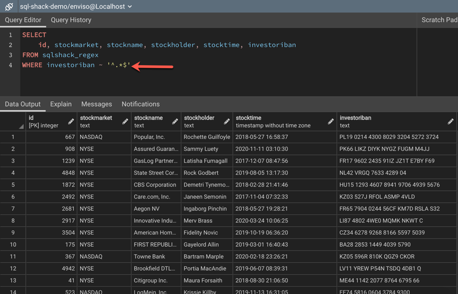{width="4.176388888888889in"
height="2.6847222222222222in"}

Şekil 2.1 Örnek PostgreSQL tablosu

17

> **2.2 Veri Tabanı Yapısı**
>
> Veri tabanı ilişkisel yapımız aşağıdaki gibidir:
>
> 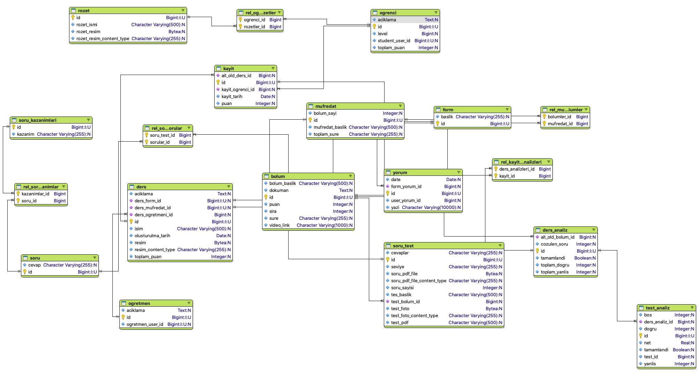{width="4.8902777777777775in"
> height="9.151388888888889in"}Şekil 2.2 Veri tabanı yapısı

18

> **2.3 Tablo Yapıları**
>
> Veri tabanlarında, verileri tutmak için belli tablolar
> hazırlanmaktadır. Projemizin veri tabanında işlemekte olan toplam 28
> tablomuz bulunmaktadır

  ----------------------------------------------------------------------------------------------------------------------------
  {width="3.7569444444444446in" height="6.063888888888889in"}
  ----------------------------------------------------------------------------------------------------------------------------

Şekil 2.3 Tablo yapıları

19

> **2.4 User Tabloları**

User işlemlerinde yetkilendirme kullandığımız için her kullanıcın
yetkisi için farklı

bir tablo daha oluşturuldu. Yetkilendirme gelen kullanıcının hangi
izinlere yetkisi

olduğu bilgisini tutan tablo. Ayrıca öğrenci ve öğretmen tabloları user
tablosundan

> kalıtım alarak öğrenci ve öğretmenin kullanıcı olduğunu tanımlıyoruz.

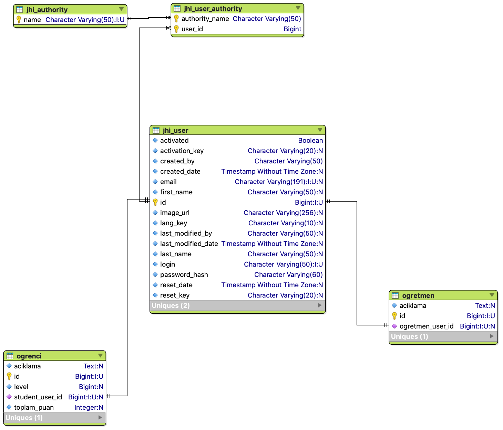{width="5.708333333333333in"
height="4.8875in"}

Şekil 2.3 Kullanıcı tablo yapısı

20

> **2.5 Ders Tabloları**

Uygulamamıza dersleri eklerken kullandığımız tablolar. Her dersin bir
müfredatı

oluyor bu müfredatın içinde bolümler oluyor. Bolüm ile müfredat arasında
çok çok

> ilişkisi var.
>
> 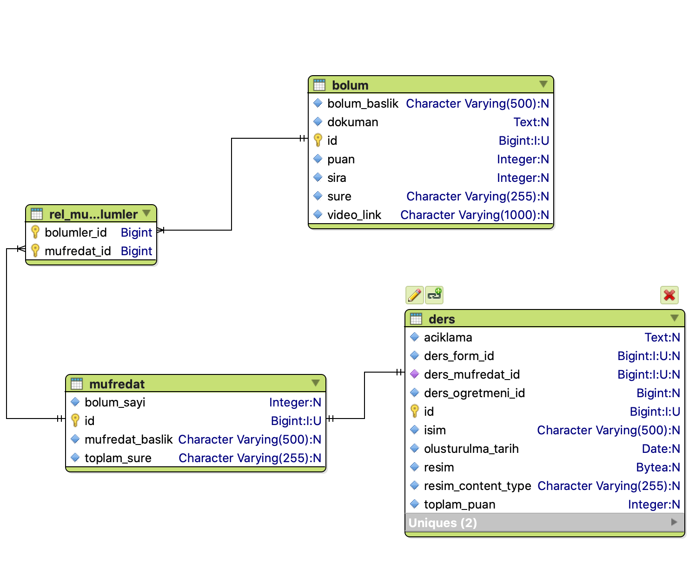{width="5.708333333333333in"
> height="4.81527668416448in"}Şekil 2.4 Ders tabloları

21

> **2.6 Kayıt Tablosu**

Öğrencinin derse kayıt bilgisini tutmak için kayıt tablosu. Öğrenci
derse ait testleri

ve dokümanlara erişebilmesi için derse kaydolması gerekmekte. Kayıt
bilgilerinin

> tutulması için kayıt tablosu gerekliydi.
>
> {width="5.708333333333333in"
> height="2.7694444444444444in"}Şekil 2.5 Kayıt tablo yapısı
>
> **2.7 Ders Analiz Tablosu**

Öğrenci derse kaydolduktan sonra derse ait analiz bilgilerini tutmak
için ders analiz

> tablosu

{width="5.0527766841644794in"
height="3.9875in"}

Şekil 2.6 Ders analiz tablo yapısı

22

> **2.8 Test Tablosu**
>
> Bölüme ait testleri bulunduran test tablosu
>
> 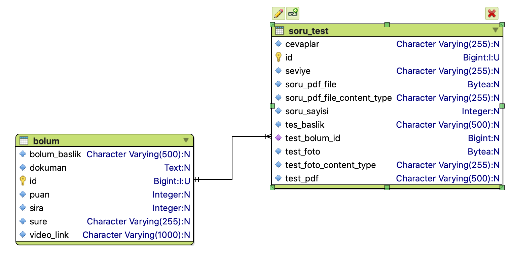{width="6.023611111111111in"
> height="3.013888888888889in"}Şekil 2.7 Test tablosu
>
> **2.9 Forum Tablosu**
>
> Öğrencilerin derslere yorum yapabilmesi için derse ait forum tablosu
> oluşturduk.
>
> {width="5.708333333333333in"
> height="1.8361100174978127in"}Şekil 2.8 Forum tablosu

23

> **2.10 Blog Tablosu**

Öğretmenlerin öğrencileri bilgilendirmesi için blog yazılar paylaşmasına
yönelik

blog tablosu. Her öğretmen blog tablosuna kayıtlı. Blog tablosu entry
tablosuna

birçok ilişkili yani bir bloğun içinde çok entry(yazi) olabilir. Her
entry'nin tag(ilgili

> konu) bilgi için ayrı bir tag tablosu oluşturuldu.
>
> 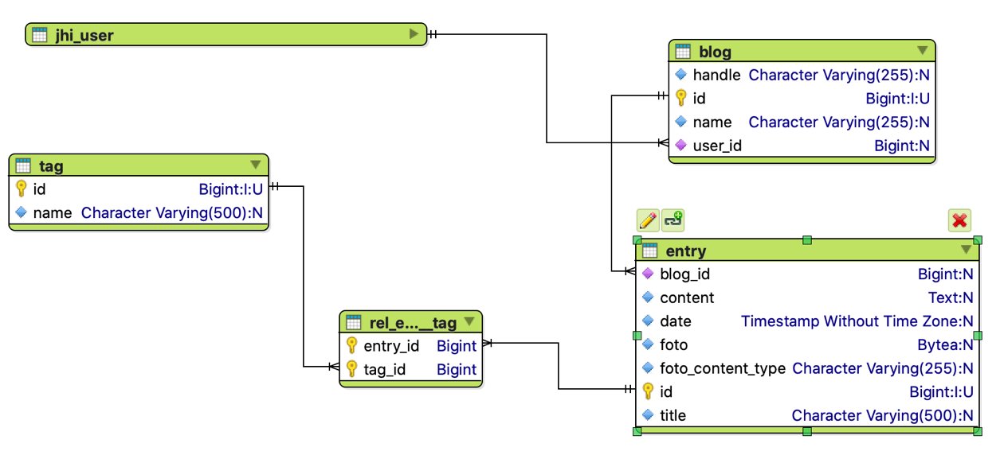{width="5.708333333333333in"
> height="2.6013888888888888in"}Şekil 2.9 Blog tablosu

24

> **BÖLÜM 3.API VE GÜVENLİK**

Veri tabanını tabloları oluşturduktan sonra bunları kullanıcıya
ulaştırmak için önce

API oluşturmamız lazım. Arka tarafta(backend) api oluşturmak için java
dilini

kullandım ve java'nın popüler olan spring kütüphanesini kullanarak Api
oluşturdum.

Spring kütüphanesi postgres bağlantısı için Spring Data JPA
kütüphanesini

kullandım. Bu yöntem ile code first yaklaşımı ile tabloları kod kısmında
oluşturdum.

> **3.1 Veri Tabanı Bağlantısı**

Veri tabanı bağlantısı yaparken spring kütüphanesinin kolay bir şekilde
veri tabanına

bağlanmayı sağlıyor. Gerekli dependencileri pom.xml dosyasına ekliyoruz.
Bu

> sayede otomatik olarak kullanacağız ihtiyacı olan kütüphaneleri
> indiriyor.

+----------+----------+-------+----------+----------+--------+------+
| > \<depe |          |       |          |          |        |      |
| ndency\> |          |       |          |          |        |      |
+==========+==========+=======+==========+==========+========+======+
| >        |          |       |          |          |        |      |
|  \<group |          |       |          |          |        |      |
| Id\>org. |          |       |          |          |        |      |
| springfr |          |       |          |          |        |      |
| amework. |          |       |          |          |        |      |
| boot\</g |          |       |          |          |        |      |
| roupId\> |          |       |          |          |        |      |
+----------+----------+-------+----------+----------+--------+------+
| > \      |          |       |          |          |        |      |
| <artifac |          |       |          |          |        |      |
| tId\>spr |          |       |          |          |        |      |
| ing-boot |          |       |          |          |        |      |
| -starter |          |       |          |          |        |      |
| -data-jp |          |       |          |          |        |      |
| a\</arti |          |       |          |          |        |      |
| factId\> |          |       |          |          |        |      |
+----------+----------+-------+----------+----------+--------+------+
| >        |          |       |          |          |        |      |
|  \</depe |          |       |          |          |        |      |
| ndency\> |          |       |          |          |        |      |
+----------+----------+-------+----------+----------+--------+------+
| > \<depe |          |       |          |          |        |      |
| ndency\> |          |       |          |          |        |      |
+----------+----------+-------+----------+----------+--------+------+
| > \<gro  |          |       |          |          |        |      |
| upId\>or |          |       |          |          |        |      |
| g.postgr |          |       |          |          |        |      |
| esql\</g |          |       |          |          |        |      |
| roupId\> |          |       |          |          |        |      |
+----------+----------+-------+----------+----------+--------+------+
| >        |          |       |          |          |        |      |
|  \<artif |          |       |          |          |        |      |
| actId\>p |          |       |          |          |        |      |
| ostgresq |          |       |          |          |        |      |
| l\</arti |          |       |          |          |        |      |
| factId\> |          |       |          |          |        |      |
+----------+----------+-------+----------+----------+--------+------+
| > \<s    |          |       |          |          |        |      |
| cope\>pr |          |       |          |          |        |      |
| ovided\< |          |       |          |          |        |      |
| /scope\> |          |       |          |          |        |      |
+----------+----------+-------+----------+----------+--------+------+
| >        |          |       |          |          |        |      |
|  \</depe |          |       |          |          |        |      |
| ndency\> |          |       |          |          |        |      |
+----------+----------+-------+----------+----------+--------+------+
| >        | ek       | sonra | konfi    | ay       | yapmak | için |
|  Depende | ledikten |       | gürasyon | arlarını |        |      |
| ncy'leri |          |       |          |          |        |      |
+----------+----------+-------+----------+----------+--------+------+

> bağlanacağımız database bilgilerini projeye özellikler dosyasına
> ekliyoruz.

+----------------------------------------------------------------------+
| > spring:\                                                           |
| > datasource:\                                                       |
| > type: com.zaxxer.hikari.HikariDataSource\                          |
| > url: jdbc:postgresql://localhost:5432/Gamification username:       |
| > Gamification\                                                      |
| > password:\                                                         |
| > hikari:\                                                           |
| > poolName: Hikari\                                                  |
| > auto-commit: false\                                                |
| > jpa:\                                                              |
| > database-platform:\                                                |
| > tech.jhipster.domain.util.FixedPostgreSQL10Dialect hibernate:\     |
| > ddl-auto: update                                                   |
+----------------------------------------------------------------------+

25

> **3.2 Api Güvenliği**

Web projelerimizi geliştirirken kullanıcı kimliklendirme/yetkilendirme
işlemi

oldukça önemlidir. Uygulamamızı yetkisiz kişilerden korumak ve yalnızca
yetkili

kullanıcıların erişimi için çeşitli yöntemler kullanırız. Bu çözümlerden
birisi de token

kullanmaktır. İşte bu noktada çeşitli standartlar bulunmaktadır. Ben
projemde JWT

> ile Authorization yöntemini kullandım.

{width="5.708333333333333in"
height="3.201388888888889in"}

Şekil 3.1 JWT senaryo

> **3.3 Swager Api Dökümansaynonu**

Swagger API, yazılım geliştiricilerin RESTful web hizmetlerini
tasarlamasına,

oluşturmasına, belgelemesine ve kullanmasına yardımcı olan geniş bir
araç

ekosistemi tarafından desteklenen açık kaynaklı bir yazılım
framework'udur. Projede

çok fazla controller olduğu için api dökümantasyonuna ihtiyaç artıyordu.
Projede

> swager ekleyerek api dökümantasyonumuzu gerçekleştirdik.
>
> 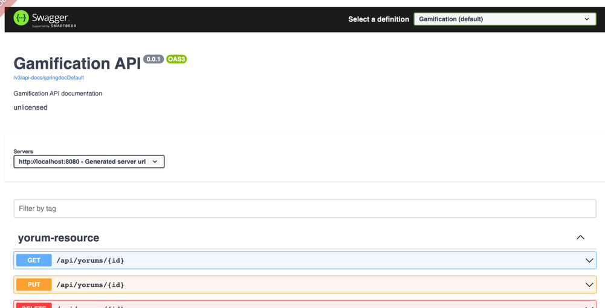{width="4.545832239720035in"
> height="2.323610017497813in"}Şekil 3.2 Swager api gönüntüsü

26

> **3.4 Exception**

Projede hata durumlarında fırlatılacak hatalar için özel exceptionlar
oluşturdum

java'nın hata durumlarını yönetme sistemi çok gelişmiş olduğu için onun

> avantajlarından yararlandım. Projeye özel hatalar için özel
> exceptionlar tanımladım.
>
> 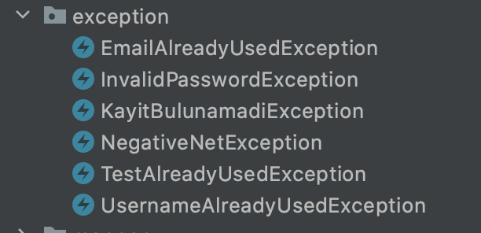{width="4.25in"
> height="2.055554461942257in"}Şekil 3.3 Özel exception\'lar

27

> **BÖLÜM 4.OYUN DİNAMİKLERİ**

Projede kullandımı oyun mekaniklerinin backend kısmında nasıl
oluşturduğumu

> hangi algoritmaları kullandığımı anlatıyorum.
>
> **4.1 Test Mekaniği**

Öğrenci testi çözdüğü zaman testin id'sini ve cevapları backend'e
gönderiyor.

Backendeki test servisinde test id'si ile veri tabanından çekilen test
cevapları

gönderilen cevaplarla karşılaştırılıp sonucu geriye kullanıcıya geri
döndürüyoruz.

Bunu yaparken aynı anda soru ve test bilgilerini öğrencinin ders analiz
sayfasına

> kayıt ediyoruz. Daha sonra çözdüğü sorunun analizini görmek için.

+----------------------------------------------------------------------+
| > List\<String\> cevapAnahtari =                                     |
| > cevapAnahtariOlustur(test.getCevaplar());\                         |
| > for (int i = 0; i \< cevapAnahtari.size(); i++) {\                 |
| > if (dto.getAnswers().get(i).equals(\"\") \|\|                      |
| > dto.getAnswers().get(i) == null) { result.increaseOfBlank();\      |
| > } else if (cevapAnahtari.get(i).equals(dto.getAnswers().get(i)))   |
| > {\                                                                 |
| > result.increaseOfCorrect();\                                       |
| > } else {\                                                          |
| > result.increaseOfWrong();\                                         |
| > }\                                                                 |
| > }                                                                  |
+----------------------------------------------------------------------+

> **4.2 Puan Mekaniği**

Öğrenci çözdüğü testlerden puan kazanıyor. Her net için 10 puan
kazanıyor eğer eksi

net yaparsa test için, o testi tekrar çözüyor o bilgiyi sisteme
kaydetmiyoruz.

> Kazandığı puanlarla öğrencilerin sıralamasına katılıyor.

28

> **4.3 Level Mekaniği**

Öğrenciler puan kazandıklarında puan kaydedilirken level bilgisi ile
kontrol ediliyor.

Eğer puanı bir sonraki levelin puanını geçiyorsa öğrenci sistem üzerinde
leveli

> yükseltiliyor.

Level'leri bir önceki levelin 1.5 üstü ile çarpımından hesaplıyoruz. İlk
levelin puan

1000 puan. Bir sonraki levelin puanı 1000 \* level \^ 1.5 ile
hesaplanıyor. Toplam 100

level var 1000=1, 2828=2, 5196=3, 8000=4, 11180=5, 14696=6, 18520=7,
22627=8,

27000=9... 955339=97, 970150=98, 985037=99, 1000000=100 levellere göre

> puanlar bu şekilde

+---------------------------------------------------------------+
| > public double nextLevel(double level) {\                    |
| > var exponent = 1.5;\                                        |
| > var baseXP = 1000;\                                         |
| > return Math.floor(baseXP \* (Math.pow(level, exponent))); } |
+---------------------------------------------------------------+

29

> **BÖLÜM 5.YÖNETİM PANELİ**
>
> **5.1 Kullanıcı Yönetimi**

Yönetim paneline girişi yalnızca admin yetkisine sahip kullanıcılar
girebilir. Admin

yetkisinde sadece admin verebilir kullanıcı yönetim sayfasından. Bu
sayfadan

kullanıcı aktif ve pasif edebilir. Kullanıcı sisteme giriş yaptıktan
sonra giriş yaptığı

mail adresine hesabını aktif etmek için kod gönderiliyor eğer oradan
aktif edemezse

> admin bu sayfa üzerinden aktif edebilir.
>
> 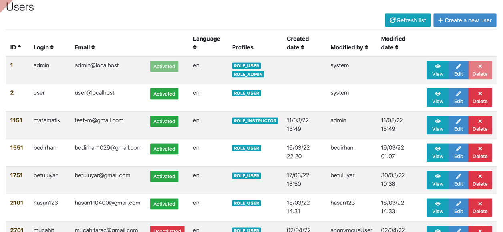{width="5.708333333333333in"
> height="2.6416666666666666in"}Şekil 5.1 Kullanıcı paneli
>
> **5.2 Uygulama Metrikleri**

Backend uygulamasını hangi durumda olduğu göstermek için hafıza,
çekirdek ve

sistem bilgilerinin ne durumda olduğunu göstermesi için java spring boot
eklentileri

> eklenerek kolayca entegre ettik.
>
> 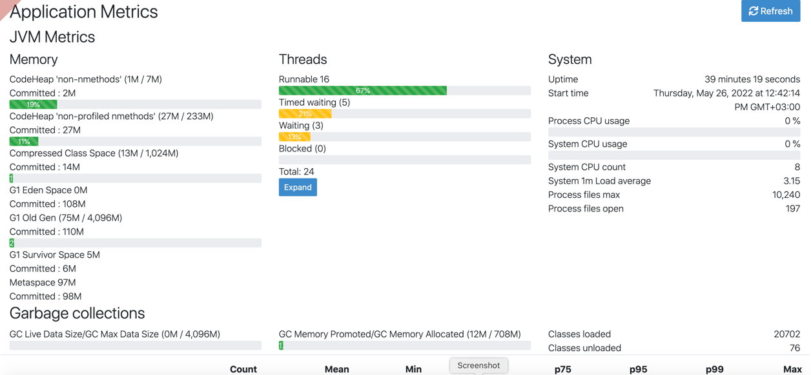{width="5.591666666666667in"
> height="2.5874989063867018in"}Şekil 5.2 Uygulama metrikleri

30

> **BÖLÜM 6.ÖN YÜZ(FRONTEND) KISMI-EKRANLAR**\
> Frontend kısmını angular 13 ile yazdım. Angular, Google tarafından
> geliştirilen ve

desteklenen SPA(Single Page Application) uygulama yapılmasına olanak
sağlayan

javascript kütüphanesidir. Backend uygulamasını angulara bağlayarak api

> bağlantısını yaptım.
>
> **6.1 Login-Register Ekranı**
>
> Kullanıcıların sisteme giriş yapabildikleri ekran
>
> **6.1.1 Üye Giriş Ekranı**
>
> 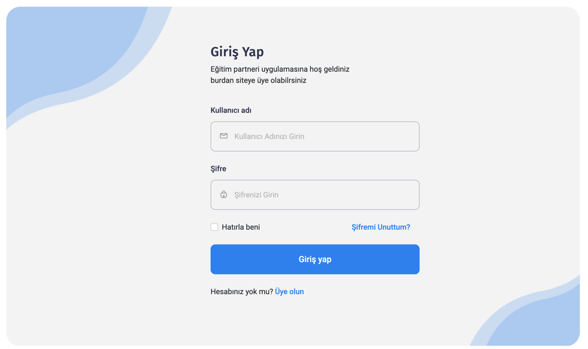{width="4.676388888888889in"
> height="2.7819444444444446in"} Şekil 6.1 Giriş yap ekran görüntüsü
>
> **6.1.2 Üye Olma Ekranı**

Hesabınızı oluşturduktan sonra girdiğiniz mail adrese hesabınızı aktif
etme kodu

> gönderiliyor\
> 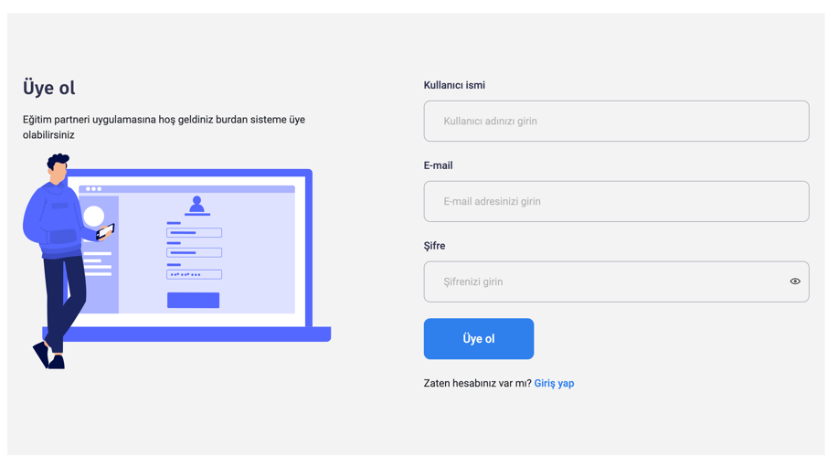{width="4.168055555555555in"
> height="2.3222222222222224in"}

Şekil 6.2 Üye ol ekran görüntüsü

{width="3.422222222222222in"
height="2.6632436570428695in"}{width="2.9861100174978126in"
height="3.5728543307086613in"}

31

> Mail adresinize gidip oradan linke tıklamalısınız

Şekil 6.3 Mail gönderildikten sonra gelen ekran görüntüsü

> Maildeki linke tıkladıktan sonra işlem başarılı ise succes değilse
> error mesajını
>
> görüyorsunuz

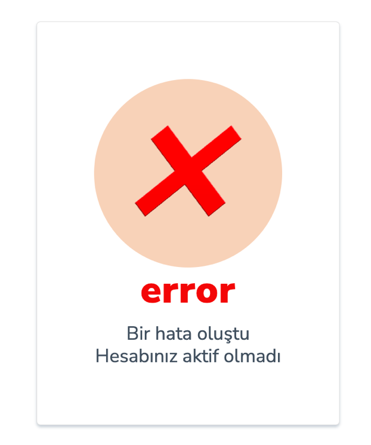{width="2.8263877952755907in"
height="3.3847222222222224in"}

+----------------------------------+----------------------------------+
| > Şekil 6.4 Hesap aktif olduktan | > Şekil 6.5 Hesap aktif olmazsa  |
| > sonra ekran görüntüsü          | > görünen ekran görüntüsü        |
+----------------------------------+----------------------------------+

32

> **6.1.3 Şifremi Unuttum Ekranı**

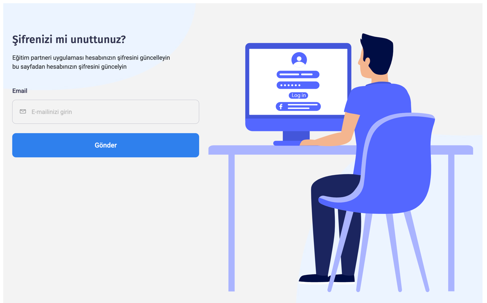{width="5.708333333333333in"
height="3.563888888888889in"}

Şekil 6.6 Şifremi unuttum ekran görüntüsü

Şifrenizi yenile sayfasında gönderdiğiniz mail adresinize link
gönderiliyor linke

> tıklayınca sizi aşağıdaki sayfaya yönlendiriyor\
> {width="5.708333333333333in"
> height="2.988888888888889in"} Şekil 6.7 Şifre yenileme ekran görüntüsü

33

> **6.2 Profil**

Giriş yaptıktan sonra profil sayfası karşılıyor bizi. Bu sayfada
kullanıcı hakkında kısa

> bilgiler var. Kazandığı rozetler ve haftalık soru hedefi yine bu
> sayfada gözüküyor.
>
> {width="5.708333333333333in"
> height="3.109722222222222in"}Şekil 6.8 Profil ekran görüntüsü
>
> {width="5.708333333333333in"
> height="4.008333333333334in"}Şekil 6.9 Profil bilgileri güncelleme
> ekran görüntüsü

34

> **6.3 Dersler Ekranı**

Admin ve öğretmenler tarafından oluşturulan dersler bu sayfada
öğrencinin karşısına

çıkıyor. Kullanıcı giriş yapmışsa derse kayıt olabiliyor, giriş yapmamış
sadece dersin

> içeriğini görebiliyor
>
> {width="5.708333333333333in"
> height="5.554166666666666in"}Şekil 6.10 Dersler ekran görüntüsü

35

> **6.4 Ders Detay Ekranı**

Kullanıcı dersin üstüne tıkladığı zaman dersin bölümleri gelmekte bu
sayfadan ders

> hakkında bilgi ve dersin bölümlerini görebiliyor.

{width="5.708333333333333in"
height="3.1305544619422574in"}

Şekil 6.11 Ders detay ekran görüntüsü

36

> **6.5 Bölüm Detay**

Girilen dersin içindeki bölümlerden bölüme tıkladıktan sonra ders
çalıştığınız

bölüme giriş yapıyorsunuz bölüm sayfasında video içerik ve doküman
oluyor. Dersi

> bitirdikten sonra ders hakkında test çözüyorsunuz.
>
> 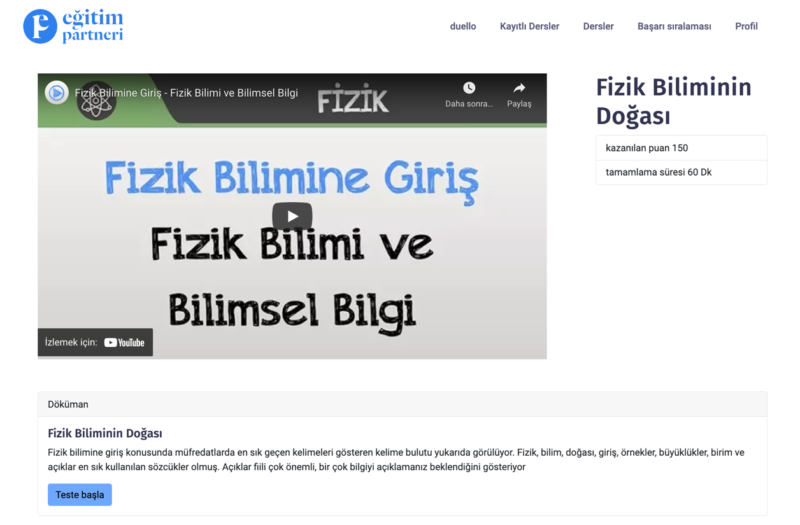{width="5.708333333333333in"
> height="3.75in"}Şekil 6.12 Bölüm detay ekranı

37

> **6.6 Test Ekranı**

Bölümün dersini izledikten sonra çalışılan konu hakkında test çözüme
sayfası testi

> tamamladıktan sonar doğru yanlış sayısını size geri döndürüyor.
>
> {width="5.708333333333333in"
> height="3.8944433508311462in"}Şekil 6.13 Çözülmemiş test ekranı
>
> Teste gönder\"nce doğru, yanlış ve boş sayısı backend kısmında
> hesaplayıp b\"ze sonucunu ger\" döndürüyor
>
> {width="5.161111111111111in"
> height="3.6180555555555554in"}Şekil 3.14 Çözülmüş test ekran görüntüsü

38

> **6.7 Ders-Analiz Ekranı**
>
> Çözdüğümüz soruların analizini yapabileceğimiz analiz sayfası
>
> {width="5.708333333333333in"
> height="4.0013877952755905in"}Şekil 6.15 Ders detay sayfası ekran
> görüntüsü

39

> **6.8 Düello**

Düello sayfasında öğrenci soru çözüyor. Doğru şıkkı işaretleyince kendi
karakteri

karşıdaki karaktere vuruyor, yanlış cevapta karşıdaki karakter oyuncunun
karakterini

dövüyor. Sayfanın üstünde can barı var hangi karakter daha fazla döverse
o karakter

> kazanıyor. Bu sayede öğrenciyi daha fazla soru çözmesini sağlamaya
> çalışıyoruz.

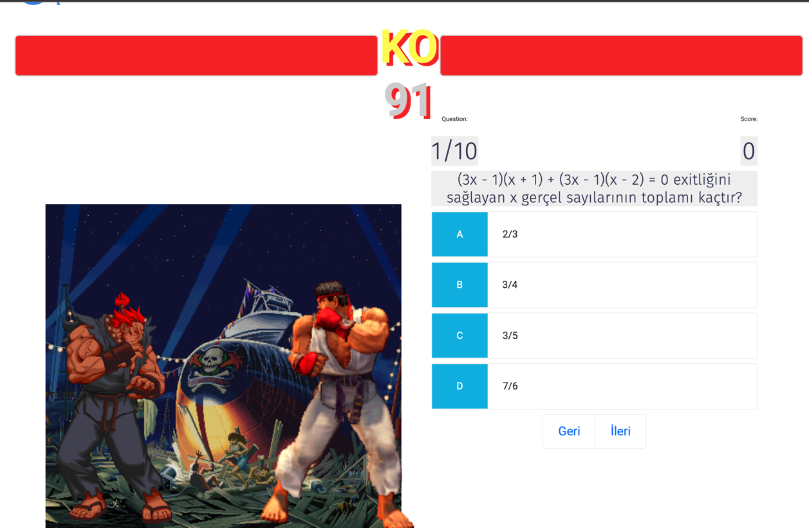{width="5.708333333333333in"
height="3.723610017497813in"}

Şekil 6.16 Düello sayfası ekran görüntüsü

40

> **6.9 Başarı Sıralaması**

Öğrencilerin kazandıkları puanlara göre diğer öğrenciler ile sıralamaya
girdikleri ilk

> on öğrencinin sıralama sayfası
>
> 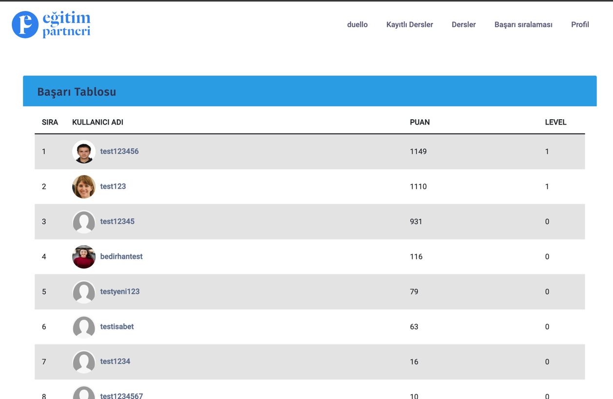{width="5.708333333333333in"
> height="3.723611111111111in"}Şekil 6.17 Başarı sıralaması ekran
> görüntüsü

41

> **6.10 Blog Sayfası**

Blog sayfası öğrencilerin ve web sitesini ziyaret edenlerin
bilgilenebileceği genel bir

sayfa bu sayfa sayesinde hem kendi kullanıcıları bilgileniyor hemde
yabancı

ziyaretçileri web sayfasına çekiyoruz. İnternette arama yaptığı
kelimeler eğer blog

> sayfasındaki bilgilerle eşleşiyorsa ziyaretçiyi bizim web sayfasına
> yönlendirecek
>
> Böylece daha fazla kullanıcı çekme şansımız artıyor.
>
> {width="5.438888888888889in"
> height="3.548611111111111in"}

Şekil 6.18 Blog sayfası ekran görüntüsü

> {width="5.233332239720035in"
> height="4.104165573053368in"}Şekil 6.19 Blog detay sayfası

42

> **BÖLÜM 7. SONUÇLAR VE ÖNERİLER**

Çalışmamız sonucunda tezin hedeflediği amaçlar fazlasıyla yerine
getirilmiştir. Hem

gelecekte bu konuda çalışma yapmak isteyen kişilere bir rehber niteliği
taşımakta

olup hem de bütün fonksiyonları tam anlamıyla çalışan bir proje ve
platform ortaya

konmuştur. Gamification dinamiklerinin olduğu öğrencilerin derslerini
takip

> edebileceği ve ders çalışabileceği bir platform başarıyla
> çalışmaktadır.

Projemiz şu anda canlı ortamda çalışmaya hazır ve kaynak kodları tamamen
açık

> şekilde Github'da paylaşılmıştır.
>
> Backend Github repositroy:
> https://github.com/kodmen/egitim-partneri-back
>
> Frontend Github repository:
> https://github.com/kodmen/gamificationFront
>
> Projenin geleceğinde ise:
>
> •Dershane ve özel eğitim kurumları ile anlaşarak onların doküman
> yardımları
>
> ile tam donanımlı bir eğitim platformu haline gelinebilir\
> •Gönüllü eğitmenler ile öğrencilere ücretsiz eğitim imkânı sunulabilir
> •Yeni oyun dinamikleri eklenerek proje geliştirilebilir
>
> **BÖLÜM 8.KAYNAKÇA**
>
> \[1\] p. K. Werbach, «Gamification,» \[Çevrimiçi\]. Available:
>
> https://www.coursera.org/learn/gamification\#instructors.

\[2\] «Bical, A. (2018). Oyunlaştırmada Oyun Elemanlarının Kullanımı:
Adidas

> Micoach, Khan Academy, Superbetter ve Swarm Uygulamalarının Örnek Olay
>
> Yöntemi İle İncelenmesine Yönelik Keşifsel Bir Çalışma (Doctoral
> dissertation,
>
> Anadolu University (Turkey)).».

\[3\] K. C. a. S. King, «Understanding industrial design: Be playful,»
\[Çevrimiçi\].

> Available:
> https://www.oreilly.com/content/understanding-industrial-design-
>
> playful/.

\[4\] «Deterding, S., Dixon, D., Khaled, R., & Nacke, L. (2011,
September). From

> game design elements to gamefulness: defining\" gamification\". In
> Proceedings of
>
> the 15th international academic MindTrek conference: Envisioning
> future media
>
> environments (pp. 9-15)».

\[5\] «Soman, D., & Huang, W. H. Y. (2013). A practitioner's guide to
gamification of

> education. Toronto: University of Toronto.».

\[6\] «KILIÇARSLAN, Z., & Altuğ, E. (2018). Kütüphanelerde Oyunlaştırma.
Türk

> Kütüphaneciliği, 32(3), 208-222.».

**44**

> **ÖZGEÇMİŞ**

Bedirhan Ergün 13.11.1999 de İstanbul Kadıköy'de doğdu. İlk, orta ve
lise eğitimini

Ümraniye de tamamladı. 2017 Erkut Soyak Anadolu lisesinden mezun oldu.
2018

Sakarya üniversitesi bilgisayar mühendisliği bölümünü kazandı. 2020
yılında

morphosium sturtup bir şirkette java backend geliştirici olarak çalıştı.
2022 yılında

> Sakarya üniversitesinden mezun olacak.

**45**

**BSM 498 BİTİRME ÇALIŞMASI**

**DEĞERLENDİRME VE SÖZLÜ SINAV TUTANAĞI**

> KONU: Gamification ile Eğitim Projesi\
> ÖĞRENCİLER (Öğrenci No/AD/SOYAD):\
> G181210055/BEDİRHAN/ERGÜN

+--------------------------------------+------------+---------+-----+
| DeğerlendNrme Konusu                 | İstenenler | Not     | Not |
|                                      |            |         |     |
|                                      |            | Aralığı |     |
+======================================+============+=========+=====+
| > **Yazılı Çalışma**                 |            |         |     |
+--------------------------------------+------------+---------+-----+
| > **Çalışma klavuza uygun olarak     | x          | 0-5     |     |
| > hazırlanmış mı?**                  |            |         |     |
+--------------------------------------+------------+---------+-----+
| > **Tekn.k Yönden**                  |            |         |     |
+--------------------------------------+------------+---------+-----+
| > **Problem\[n tanımı yapılmış mı?** | x          | 0-5     |     |
+--------------------------------------+------------+---------+-----+
| > Gel1şt1r1lecek yazılımın/donanımın |            |         |     |
| > m1mar1s1n1 1çeren blok şeması\     |            |         |     |
| > (yazılımlar 1ç1n ver1 akış şeması  |            |         |     |
| > (dfd) da olab1l1r) ç1z1lerek       |            |         |     |
| > açıklanmış mı?                     |            |         |     |
+--------------------------------------+------------+---------+-----+
| Blok şemadak1 b1r1mler arasındak1    |            |         |     |
| b1lg1 akışına a1t model/göster1m var |            |         |     |
| mı?                                  |            |         |     |
+--------------------------------------+------------+---------+-----+
| > Yazılımın gereks1n1m l1stes1       |            |         |     |
| > oluşturulmuş mu?                   |            |         |     |
+--------------------------------------+------------+---------+-----+
| > Kullanılan/kullanılması düşünülen  |            |         |     |
| > araçlar/teknoloj1ler anlatılmış    |            |         |     |
| > mı?                                |            |         |     |
+--------------------------------------+------------+---------+-----+
| > Donanımların                       |            |         |     |
| > programlanması/konf1gürasyonu 1ç1n |            |         |     |
| > yazılım gereks1n1mler1 bel1rt1lm1ş |            |         |     |
| > m1?                                |            |         |     |
+--------------------------------------+------------+---------+-----+
| > UML 1le modelleme yapılmış mı?     |            |         |     |
+--------------------------------------+------------+---------+-----+
| > Ver1tabanları kullanılmış 1se      |            |         |     |
| > kavramsal model çıkarılmış mı?     |            |         |     |
| > (Varlık 1l1şk1 model1, noSQL       |            |         |     |
| > kavramsal modeller1 v.b.)          |            |         |     |
+--------------------------------------+------------+---------+-----+
| Projeye yönel1k 1ş-zaman ç1zelges1   |            |         |     |
| çıkarılarak mal1yet anal1z1 yapılmış |            |         |     |
| mı?                                  |            |         |     |
+--------------------------------------+------------+---------+-----+
| > Donanım b1leşenler1n1n mal1yet     |            |         |     |
| > anal1z1 (protot1p-adetl1 ser1      |            |         |     |
| > üret1m vb.) çıkarılmış mı?         |            |         |     |
+--------------------------------------+------------+---------+-----+
| > Donanım 1ç1n gerekl1 enerj1        |            |         |     |
| > anal1z1                            |            |         |     |
| > (m1n1mum-uyku-akt1f-maks1mum)      |            |         |     |
| > yapılmış mı?                       |            |         |     |
+--------------------------------------+------------+---------+-----+
| > Grup çalışmalarında grup           |            |         |     |
| > üyeler1n1n görev tanımları         |            |         |     |
| > ver1lm1ş m1 (1ş-zaman ç1zelges1nde |            |         |     |
| > bel1rt1leb1l1r)?                   |            |         |     |
+--------------------------------------+------------+---------+-----+
| > Sürüm denet1m s1stem1 (Vers1on     |            |         |     |
| > Control System; G1t, Subvers1on    |            |         |     |
| > v.s.) kullanılmış mı?              |            |         |     |
+--------------------------------------+------------+---------+-----+
| > S1stem1n genel test1 1ç1n          |            |         |     |
| > uygulanan metotlar ve 1y1leşt1rme  |            |         |     |
| > süreçler1n1n dökümü ver1lm1ş m1?   |            |         |     |
+--------------------------------------+------------+---------+-----+
| > Yazılımın sızma test1 yapılmış mı? |            |         |     |
+--------------------------------------+------------+---------+-----+
| > Performans test1 yapılmış mı?      |            |         |     |
+--------------------------------------+------------+---------+-----+
| > Tasarımın uygulamasında ortaya     |            |         |     |
| > çıkan uyumsuzluklar ve aksaklıklar |            |         |     |
| > bel1rt1lerek çözüm yöntemler1      |            |         |     |
| > tartışılmış mı?                    |            |         |     |
+--------------------------------------+------------+---------+-----+
| > **Yapılan \[şler\[n zorluk         | x          | 0-25    |     |
| > dereces\[?**                       |            |         |     |
+--------------------------------------+------------+---------+-----+
| > **Sözlü Sınav**                    |            |         |     |
+--------------------------------------+------------+---------+-----+
| > **Yapılan sunum başarılı mı?**     | x          | 0-5     |     |
+--------------------------------------+------------+---------+-----+
| > **Soruları yanıtlama               | x          | 0-20    |     |
| > yetk\[nl\[ğ\[?**                   |            |         |     |
+--------------------------------------+------------+---------+-----+
| > **Devam Durumu**                   |            |         |     |
+--------------------------------------+------------+---------+-----+
| > **Öğrenc( dönem (çer(s(ndek(       | x          | 0-5     |     |
| > raporlarını düzenl( olarak         |            |         |     |
| > hazırladı mı?**                    |            |         |     |
+--------------------------------------+------------+---------+-----+
| > **D.ğer Maddeler**                 |            |         |     |
+--------------------------------------+------------+---------+-----+
|                                      |            |         |     |
+--------------------------------------+------------+---------+-----+
|                                      |            |         |     |
+--------------------------------------+------------+---------+-----+
|                                      |            |         |     |
+--------------------------------------+------------+---------+-----+
| > **Toplam**                         |            |         |     |
+--------------------------------------+------------+---------+-----+

> DANIŞMAN (JÜRİ ADINA): PROF.DR.AHMET ZENGİN DANIŞMAN İMZASI:
