**EĞİTİMDE OYUNLAŞTIRMA WEB PROJESİ**

**Bedirhan Ergün**

  **ÖNSÖZ**

Teknoloji çağıyla birlikte hayat çok daha hızlı akmaya başlamıştır. Bu
hızlı akışa

ayak uydurmaya çalışılırken günlük yaşamda yapılması gereken işler,
görevler, vb.

bazen çok sıkıcı hale gelebilmekte, bu da performans düşüklüğüne neden
olmaktadır.

Bu soruna çözüm bulmanın en iyi yollarından biri oyunlaştırmadır.
Oyunlaştırma

hayatın içindeki görevleri yerine getirirken eğlenmeyi sağlamakla
kalmayıp,

görevlerdeki performansı en üst düzeye çıkarmaktadır. Bizde
oyunlaştırmaya

üniversiteye hazırlanan öğrencilerin motivasyonlarını yüksek tutmak ve
ders çalışma

sürelerini arttırmak için gamification dinamiklerini kullanarak Egitim
Partneri uygulamasını geliştirdik.
 

  **İÇİNDEKİLER**

  **BÖLÜM 2.VERİ TABANI**
  1. POSTGRESQL VERİ TABANI
  2. VERİ TABANI YAPISI
  3. TABLO YAPILARI
  4. USER TABLOLARI
  5. DERS TABLOLARI
  6. KAYIT TABLOSU
  7. DERS ANALİZ TABLOSU
  8. TEST TABLOSU
  9. FORUM TABLOSU
  10. BLOG TABLOSU

 **BÖLÜM 5.YÖNETİM PANELİ**
  1. KULLANICI YÖNETİMİ
  2. UYGULAMA METRİKLERİ

 **BÖLÜM 6.ÖN YÜZ(FRONTEND) KISMI-EKRANLAR**
  1. LOGİN-REGİSTER EKRANI
    1. Üye G1r1ş Ekranı
    2. Üye Olma Ekranı
    3. Ş1frem1 Unuttum Ekranı
  2. PROFİL
  3. DERSLER EKRANI
  4. DERS DETAY EKRANI
  5. BÖLÜM DETAY
  6. TEST EKRANI
  7. DERS-ANALİZ EKRANI
  8. DUELLO
  9. BAŞARI SIRALAMASI
  10. BLOG SAYFASI

  **BÖLÜM 2.VERİ TABANI**

Backend kısmını java spring boot tercih ettiğimizden java ile iyi
çalışan veri tabanı postgresql ile oluşturduk.
 
  **2.1 Postgresql Veri Tabanı**

PostgreSQL, gelişmiş, kurumsal sınıf ve açık kaynaklı bir ilişkisel
veritabanı

sistemidir. PostgreSQL, hem SQL (ilişkisel) hem de JSON (ilişkisel
olmayan)

sorgulamayı destekler. PostgreSQL, açık kaynak topluluğu tarafından 20
yılı aşkın

geliştirmeyle desteklenen oldukça kararlı bir veritabanıdır. PostgreSQL,
birçok web

uygulamasının yanı sıra mobil ve analitik uygulamalar için birincil
veritabanı olarak kullanılır.

  **2.2 Veri Tabanı Yapısı**
 
  Veri tabanı ilişkisel yapımız aşağıdaki gibidir:
 
  

  **2.3 Tablo Yapıları**
 
  Veri tabanlarında, verileri tutmak için belli tablolar
  hazırlanmaktadır. Projemizin veri tabanında işlemekte olan toplam 28
  tablomuz bulunmaktadır

  ----------------------------------------------------------------------------------------------------------------------------
  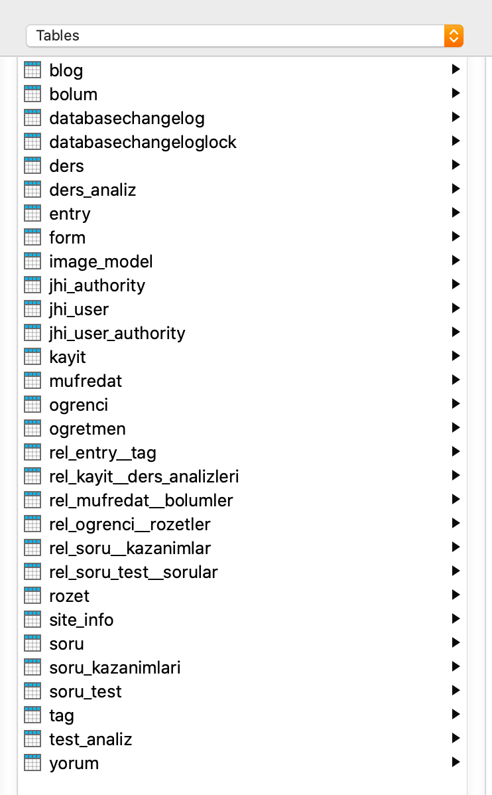
  ----------------------------------------------------------------------------------------------------------------------------

  **2.4 User Tabloları**

User işlemlerinde yetkilendirme kullandığımız için her kullanıcın
yetkisi için farklı

bir tablo daha oluşturuldu. Yetkilendirme gelen kullanıcının hangi
izinlere yetkisi

olduğu bilgisini tutan tablo. Ayrıca öğrenci ve öğretmen tabloları user
tablosundan

  kalıtım alarak öğrenci ve öğretmenin kullanıcı olduğunu tanımlıyoruz.

  **2.5 Ders Tabloları**

Uygulamamıza dersleri eklerken kullandığımız tablolar. Her dersin bir
müfredatı

oluyor bu müfredatın içinde bolümler oluyor. Bolüm ile müfredat arasında
çok çok ilişkisi var.

  

  **2.6 Kayıt Tablosu**

Öğrencinin derse kayıt bilgisini tutmak için kayıt tablosu. Öğrenci
derse ait testleri

ve dokümanlara erişebilmesi için derse kaydolması gerekmekte. Kayıt
bilgilerinin tutulması için kayıt tablosu gerekliydi.

 
  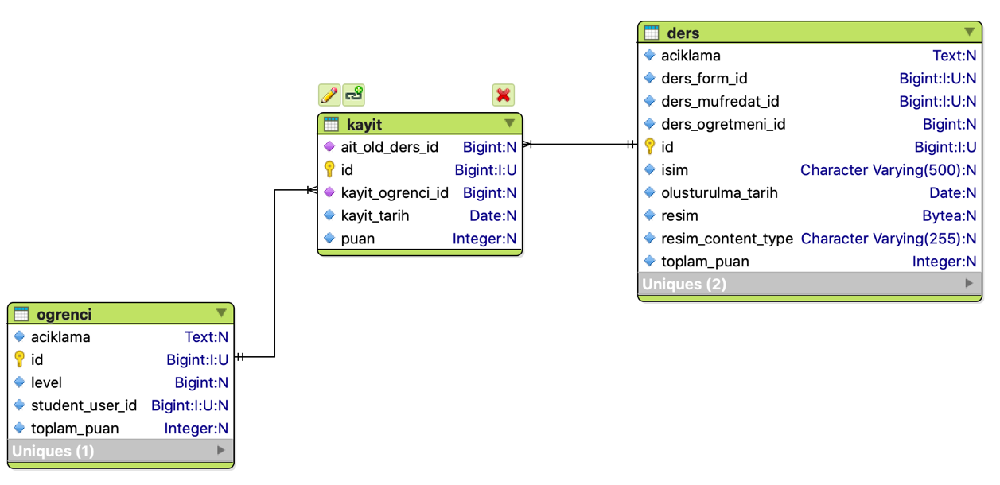
 
  **2.7 Ders Analiz Tablosu**

Öğrenci derse kaydolduktan sonra derse ait analiz bilgilerini tutmak
için ders analiz tablosu

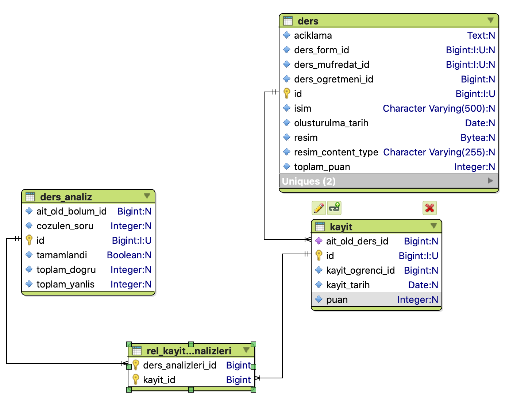

  **2.8 Test Tablosu**

Bölüme ait testleri bulunduran test tablosu
 
  
 
  **2.9 Forum Tablosu**
 
Öğrencilerin derslere yorum yapabilmesi için derse ait forum tablosu
 oluşturduk.
 
  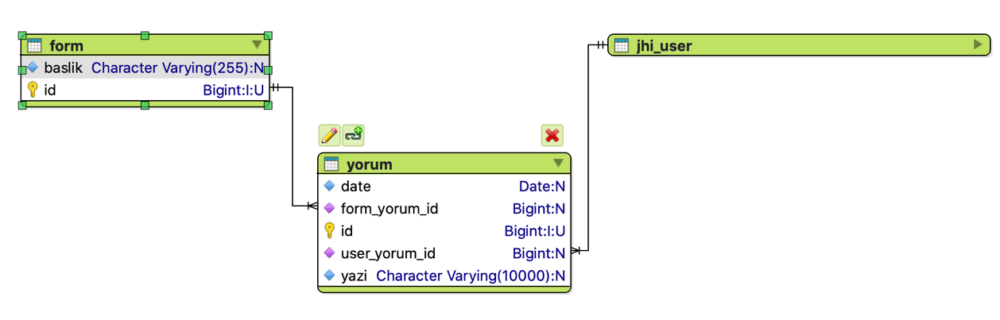

  **2.10 Blog Tablosu**

Öğretmenlerin öğrencileri bilgilendirmesi için blog yazılar paylaşmasına
yönelik

blog tablosu. Her öğretmen blog tablosuna kayıtlı. Blog tablosu entry
tablosuna

birçok ilişkili yani bir bloğun içinde çok entry(yazi) olabilir. Her
entry'nin tag(ilgili konu) bilgi için ayrı bir tag tablosu oluşturuldu.
 
  

  **BÖLÜM 5.YÖNETİM PANELİ**
 
  **5.1 Kullanıcı Yönetimi**

Yönetim paneline girişi yalnızca admin yetkisine sahip kullanıcılar
girebilir. Admin

yetkisinde sadece admin verebilir kullanıcı yönetim sayfasından. Bu
sayfadan

kullanıcı aktif ve pasif edebilir. Kullanıcı sisteme giriş yaptıktan
sonra giriş yaptığı

mail adresine hesabını aktif etmek için kod gönderiliyor eğer oradan
aktif edemezse admin bu sayfa üzerinden aktif edebilir.
 
  
 
  **5.2 Uygulama Metrikleri**

Backend uygulamasını hangi durumda olduğu göstermek için hafıza,
çekirdek ve

sistem bilgilerinin ne durumda olduğunu göstermesi için java spring boot
eklentileri eklenerek kolayca entegre ettik.
 
  

  **BÖLÜM 6.ÖN YÜZ(FRONTEND) KISMI-EKRANLAR**\
  
  
Frontend kısmını angular 13 ile yazdım. Angular, Google tarafından
geliştirilen ve
desteklenen SPA(Single Page Application) uygulama yapılmasına olanak
sağlayan javascript kütüphanesidir. Backend uygulamasını angulara bağlayarak api bağlantısını yaptım.
 
  **6.1 Login-Register Ekranı**
 
  Kullanıcıların sisteme giriş yapabildikleri ekran
 
  **6.1.1 Üye Giriş Ekranı**
 
   
 
  **6.1.2 Üye Olma Ekranı**

  
Hesabınızı oluşturduktan sonra girdiğiniz mail adrese hesabınızı aktif
etme kodu gönderiliyor

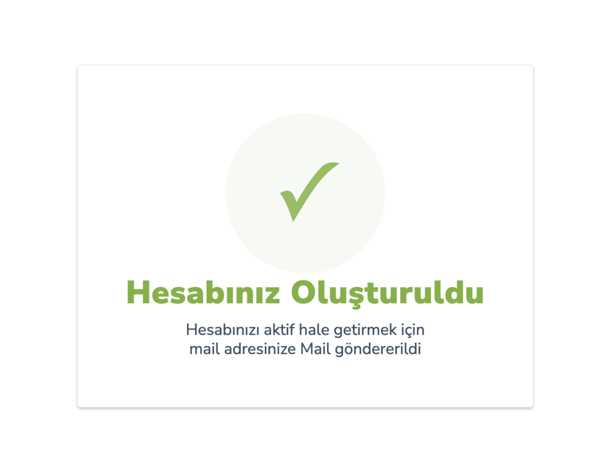 
  Mail adresinize gidip oradan linke tıklamalısınız

  Maildeki linke tıkladıktan sonra işlem başarılı ise succes değilse
  error mesajını görüyorsunuz

  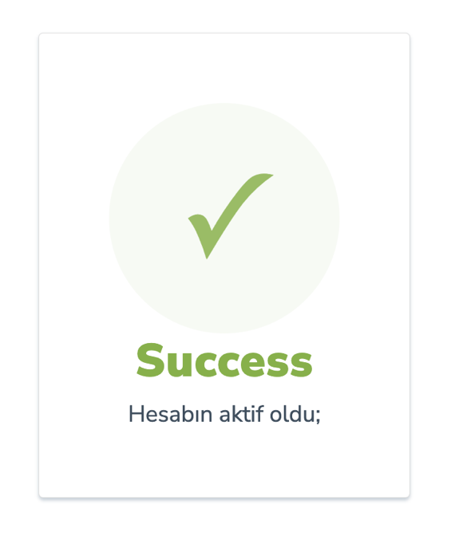
   

  **6.1.3 Şifremi Unuttum Ekranı**

Şifrenizi yenile sayfasında gönderdiğiniz mail adresinize link
gönderiliyor linke tıklayınca sizi aşağıdaki sayfaya yönlendiriyor

  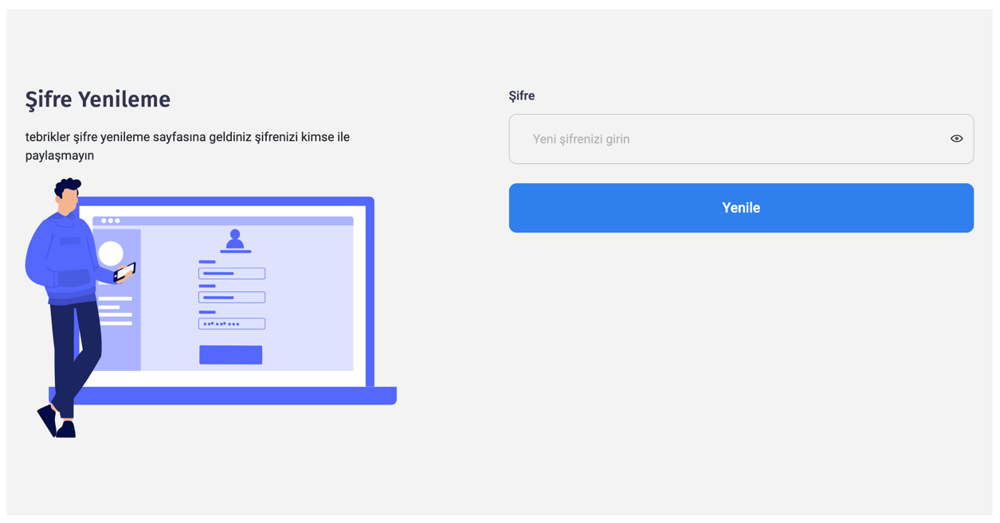

  **6.2 Profil**

Giriş yaptıktan sonra profil sayfası karşılıyor bizi. Bu sayfada
kullanıcı hakkında kısa bilgiler var. Kazandığı rozetler ve haftalık soru hedefi yine bu
sayfada gözüküyor.
 
  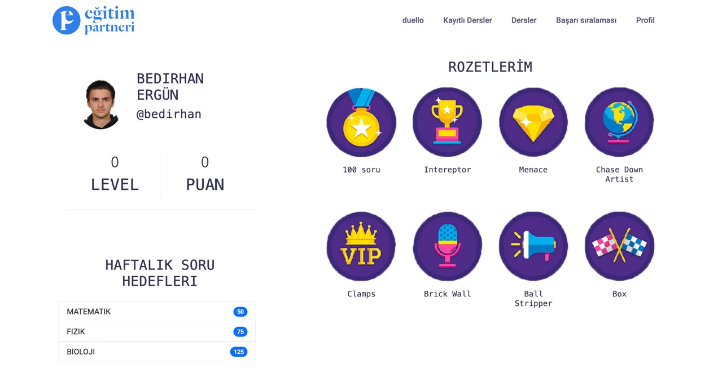
 
  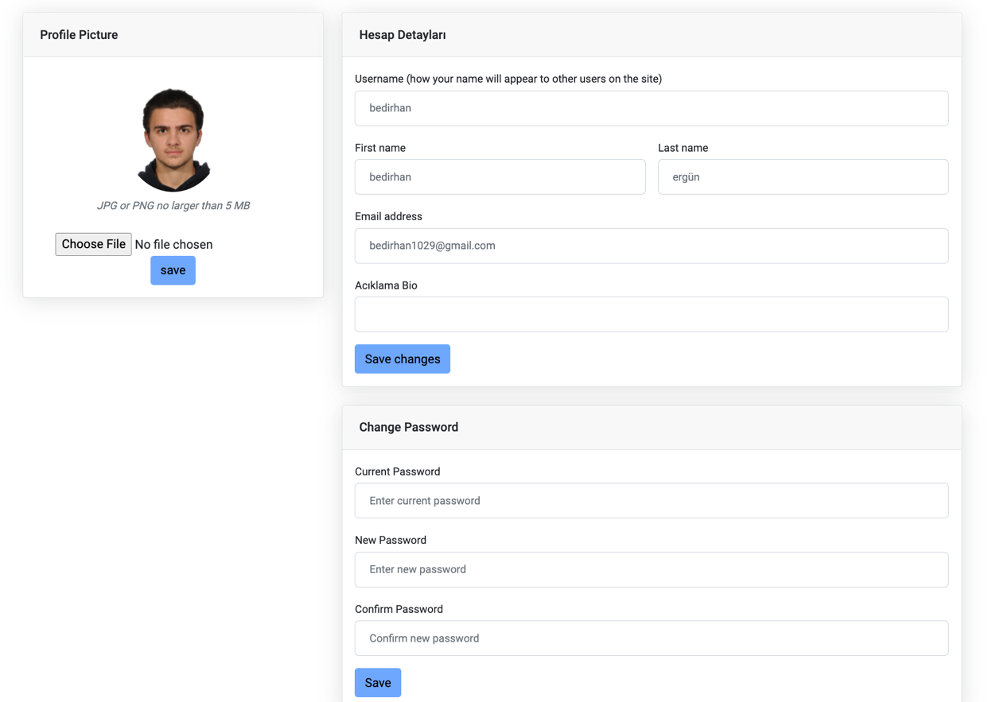

  **6.3 Dersler Ekranı**

Admin ve öğretmenler tarafından oluşturulan dersler bu sayfada
öğrencinin karşısına çıkıyor. Kullanıcı giriş yapmışsa derse kayıt olabiliyor, giriş yapmamış
sadece dersin içeriğini görebiliyor

  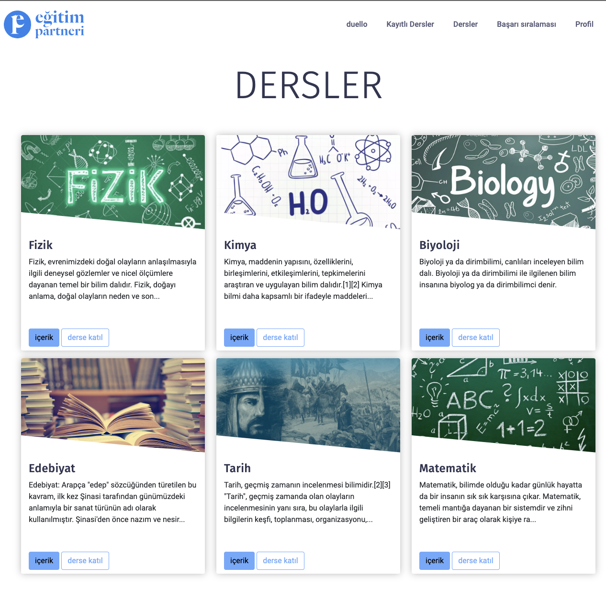

  **6.4 Ders Detay Ekranı**

Kullanıcı dersin üstüne tıkladığı zaman dersin bölümleri gelmekte bu
sayfadan ders hakkında bilgi ve dersin bölümlerini görebiliyor.

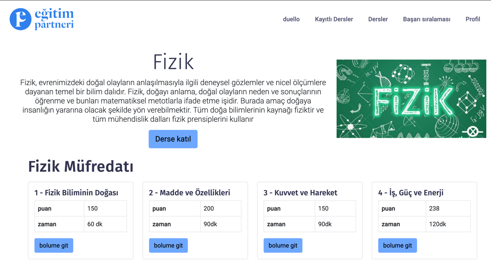

  **6.5 Bölüm Detay**

Girilen dersin içindeki bölümlerden bölüme tıkladıktan sonra ders
çalıştığınız bölüme giriş yapıyorsunuz bölüm sayfasında video içerik ve doküman
oluyor. Dersi bitirdikten sonra ders hakkında test çözüyorsunuz.
 
  

  **6.6 Test Ekranı**

Bölümün dersini izledikten sonra çalışılan konu hakkında test çözüme
sayfası testi tamamladıktan sonar doğru yanlış sayısını size geri döndürüyor.

  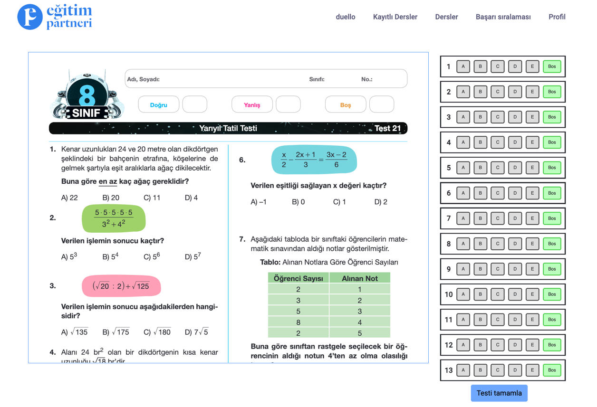
 
  Teste gönderince doğru, yanlış ve boş sayısı backend kısmında
  hesaplayıp bize sonucunu geri döndürüyor

  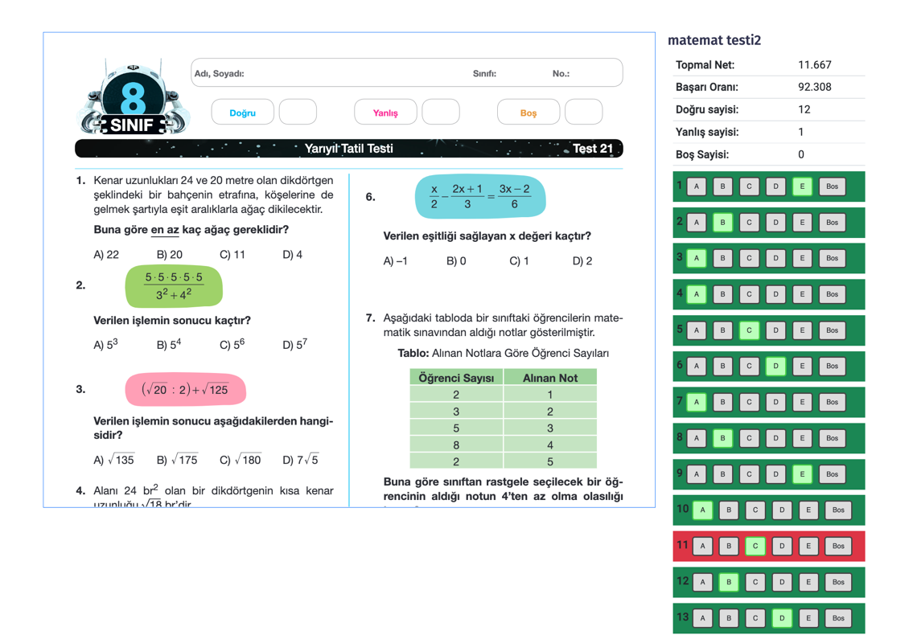 

  **6.7 Ders-Analiz Ekranı**
 
  Çözdüğümüz soruların analizini yapabileceğimiz analiz sayfası
 
  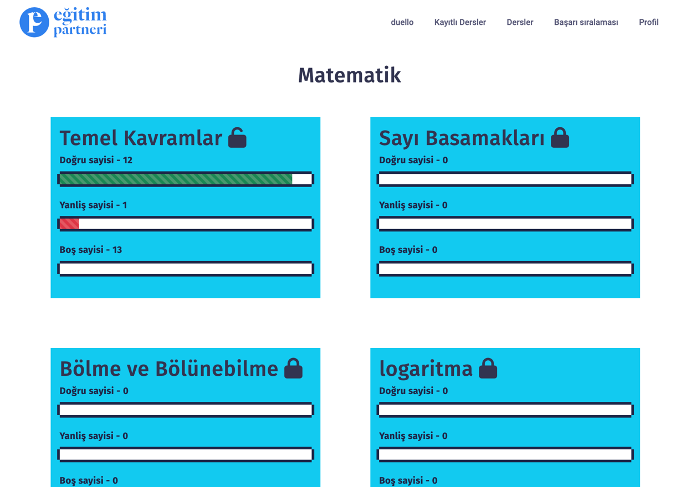

  **6.8 Düello**

Düello sayfasında öğrenci soru çözüyor. Doğru şıkkı işaretleyince kendi
karakteri

karşıdaki karaktere vuruyor, yanlış cevapta karşıdaki karakter oyuncunun
karakterini

dövüyor. Sayfanın üstünde can barı var hangi karakter daha fazla döverse
o karakter kazanıyor. Bu sayede öğrenciyi daha fazla soru çözmesini sağlamaya çalışıyoruz.

Şekil 6.16 Düello sayfası ekran görüntüsü

  **6.9 Başarı Sıralaması**

Öğrencilerin kazandıkları puanlara göre diğer öğrenciler ile sıralamaya
girdikleri ilk on öğrencinin sıralama sayfası
 
  Şekil 6.17 Başarı sıralaması ekran görüntüsü

  **6.10 Blog Sayfası**

Blog sayfası öğrencilerin ve web sitesini ziyaret edenlerin
bilgilenebileceği genel bir sayfa bu sayfa sayesinde hem kendi kullanıcıları bilgileniyor hemde
yabancı ziyaretçileri web sayfasına çekiyoruz. İnternette arama yaptığı
kelimeler eğer blog sayfasındaki bilgilerle eşleşiyorsa ziyaretçiyi bizim web sayfasına yönlendirecek Böylece daha fazla kullanıcı çekme şansımız artıyor.

  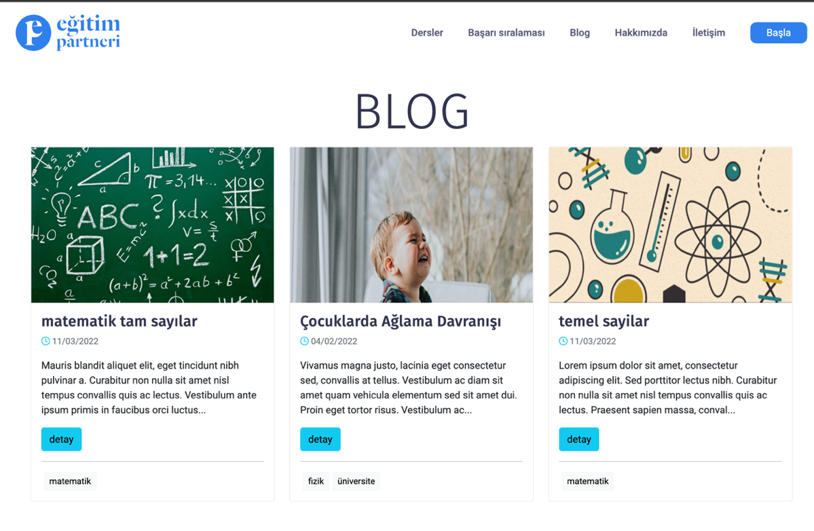

Şekil 6.18 Blog sayfası ekran görüntüsü

  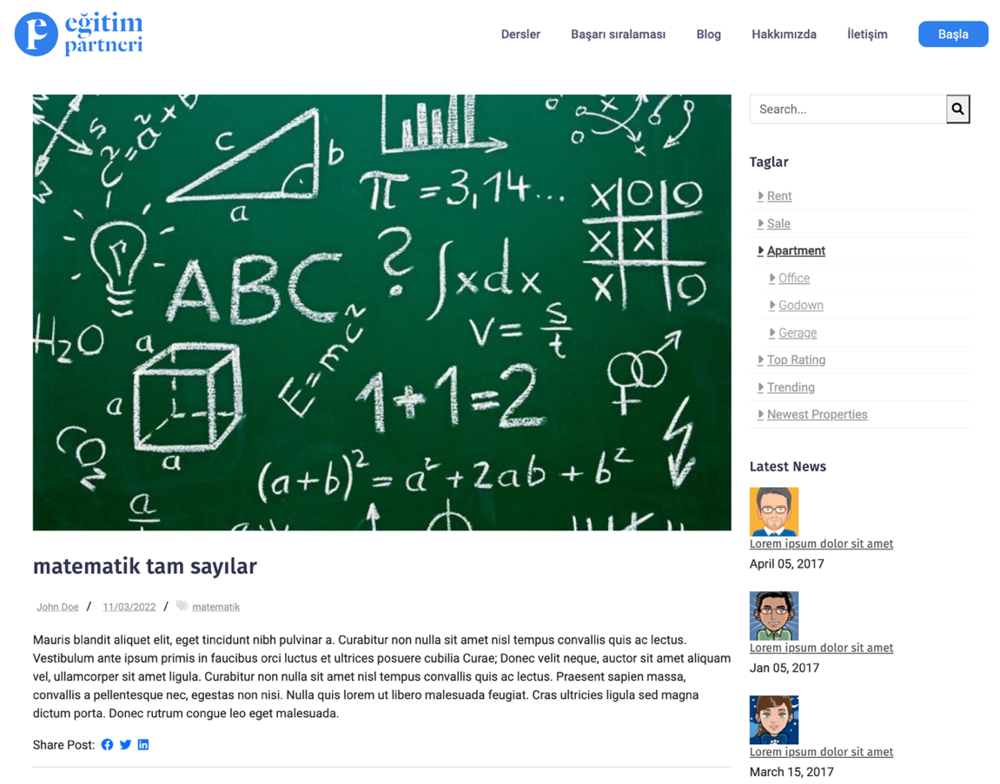Şekil 6.19 Blog detay sayfası

  **BÖLÜM 7. SONUÇLAR VE ÖNERİLER**

Çalışmamız sonucunda tezin hedeflediği amaçlar fazlasıyla yerine
getirilmiştir. Hem

gelecekte bu konuda çalışma yapmak isteyen kişilere bir rehber niteliği
taşımakta

olup hem de bütün fonksiyonları tam anlamıyla çalışan bir proje ve
platform ortaya

konmuştur. Gamification dinamiklerinin olduğu öğrencilerin derslerini
takip

  edebileceği ve ders çalışabileceği bir platform başarıyla
  çalışmaktadır.

Projemiz şu anda canlı ortamda çalışmaya hazır ve kaynak kodları tamamen
açık

  şekilde Github'da paylaşılmıştır.
 
  Backend Github repositroy:
  https://github.com/kodmen/egitim-partneri-back
 
  Frontend Github repository:
  https://github.com/kodmen/gamificationFront
 
  Projenin geleceğinde ise:
 
  •Dershane ve özel eğitim kurumları ile anlaşarak onların doküman
  yardımları
 
  ile tam donanımlı bir eğitim platformu haline gelinebilir\
  •Gönüllü eğitmenler ile öğrencilere ücretsiz eğitim imkânı sunulabilir
  •Yeni oyun dinamikleri eklenerek proje geliştirilebilir
